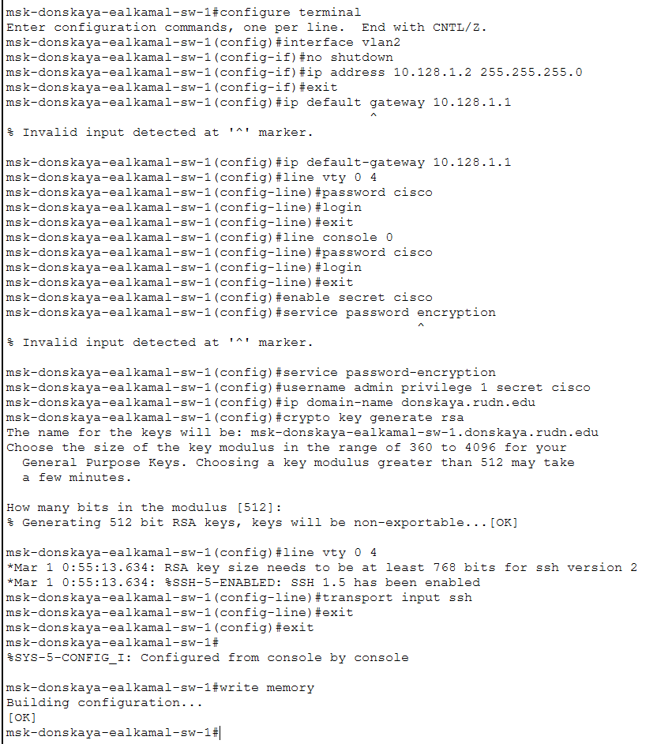
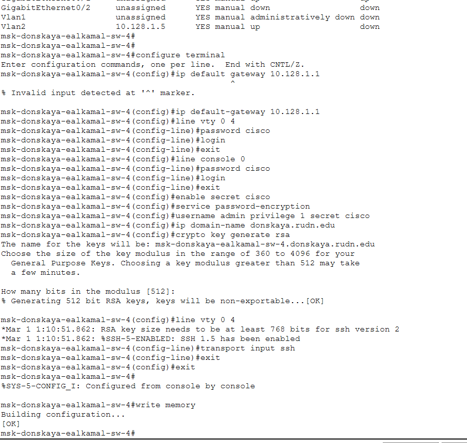
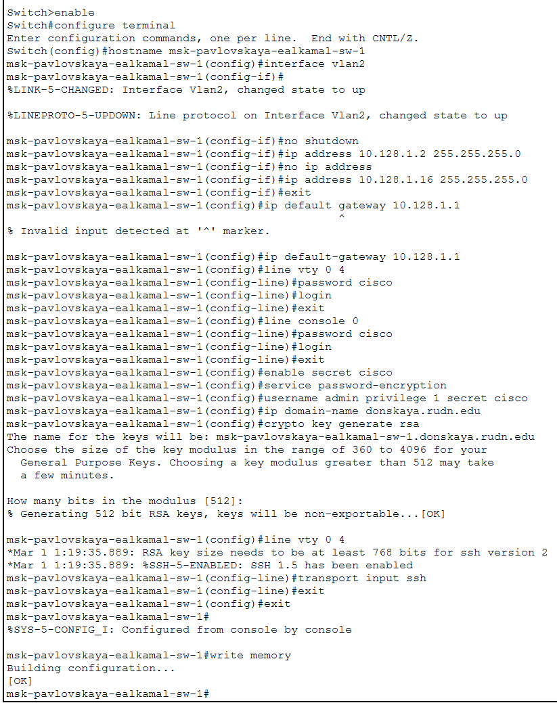

---
## Author
author:
  name: Ибрахим Мохсейн Алькамаль
  degrees: Student (3 курс)
  orcid: ""
  email: 1032225432@rudn.ru
  affiliation:
    - name: Российский университет дружбы народов
      country: Российская Федерация
      postal-code: 117198
      city: Москва
      address: ул. Миклухо-Маклая, д. 6
## Title
title: Лабораторная работа №4
subtitle: Администрирование локальных сетей
license: CC BY
date: today
date-format: "YYYY-MM-DD" # Example: 2025-09-06
---

# Информация

## Докладчик

:::::::::::::: {.columns align=center}
::: {.column width="70%"}

  * Ибрахим Мохсейн Алькамаль
  * Российский университет дружбы народов

:::
::: {.column width="30%"}

:::
::::::::::::::

# Цель работы

- Подготовка к первоначальной настройке сетевых коммутаторов
- Изучение процесса базовой конфигурации сетевых устройств
- Ознакомление с использованием Markdown для подготовки отчёта

# Выполнение лабораторной работы

## Размещение устройств и топология сети

- Размещение коммутаторов, рабочих станций и серверов в логической области симулятора
- Разделение сети на две части: «Москва, Павловская» и «Москва, Донская»
- Соединение коммутаторов через интерфейсы FastEthernet и GigabitEthernet
- Использование интерфейса VLAN2 для управления коммутаторами
- Применение адресов из сети 10.128.1.0/24

---

{#fig-1 width=70%}

## Первоначальная настройка коммутатора msk-donskaya-ealkamal-sw-1

- Выполнение базовой конфигурации коммутатора через CLI
- Установка имени устройства `msk-donskaya-ealkamal-sw-1`
- Настройка интерфейса VLAN2
- Назначение IP-адреса 10.128.1.2/24
- Активация интерфейса командой `no shutdown`
- Настройка шлюза по умолчанию 10.128.1.1
- Настройка доступа через VTY и консоль с паролем `cisco`
- Создание пользователя `admin`
- Включение шифрования паролей
- Настройка домена `donskaya.rudn.edu`
- Генерация RSA-ключей
- Разрешение удалённого доступа по SSH
- Сохранение конфигурации устройства

---

{#fig-2 width=70%}

## Настройка коммутатора msk-donskaya-ealkamal-sw-2

- Выполнение первоначальной конфигурации коммутатора
- Установка имени устройства `msk-donskaya-ealkamal-sw-2`
- Настройка интерфейса VLAN2
- Назначение IP-адреса 10.128.1.3/24
- Активация интерфейса VLAN2
- Установка шлюза по умолчанию 10.128.1.1
- Настройка доступа через VTY и консоль с паролем `cisco`
- Создание пользователя `admin`
- Включение шифрования паролей
- Настройка домена сети
- Генерация RSA-ключей для SSH
- Сохранение конфигурации

---

{#fig-3 width=70%}

## Настройка коммутатора msk-donskaya-ealkamal-sw-3

- Выполнение первоначальной конфигурации коммутатора
- Установка имени устройства `msk-donskaya-ealkamal-sw-3`
- Назначение IP-адреса 10.128.1.4/24 на интерфейсе VLAN2
- Активация интерфейса VLAN2
- Настройка доступа через VTY и консоль
- Включение шифрования паролей
- Создание пользователя `admin`
- Генерация RSA-ключей
- Настройка доступа по SSH
- Сохранение конфигурации

---

{#fig-4 width=70%}

## Настройка коммутатора msk-donskaya-ealkamal-sw-4

- Выполнение настройки интерфейса VLAN2
- Назначение IP-адреса 10.128.1.5/24
- Установка шлюза по умолчанию 10.128.1.1
- Настройка доступа через VTY и консоль
- Установка пароля `cisco`
- Включение шифрования паролей
- Создание пользователя `admin`
- Настройка домена сети
- Генерация RSA-ключей
- Разрешение удалённого доступа по SSH
- Сохранение конфигурации

---

{#fig-5 width=70%}

## Настройка коммутатора msk-pavlovskaya-ealkamal-sw-1

- Выполнение первоначальной конфигурации коммутатора
- Установка имени устройства `msk-pavlovskaya-ealkamal-sw-1`
- Назначение IP-адреса 10.128.1.16/24 на интерфейсе VLAN2
- Активация интерфейса VLAN2
- Установка шлюза по умолчанию 10.128.1.1
- Настройка доступа через VTY и консоль
- Создание пользователя `admin`
- Включение шифрования паролей
- Настройка домена сети
- Генерация RSA-ключей
- Разрешение удалённого доступа по SSH
- Сохранение конфигурации

---

{#fig-6 width=70%}

# Выводы

- Выполнена первоначальная настройка сетевых коммутаторов
- Каждому устройству назначено уникальное имя
- Настроены IP-адреса управления на интерфейсе VLAN2
- Установлен шлюз по умолчанию
- Настроен доступ через консоль и виртуальные терминалы
- Включено шифрование паролей
- Создан пользователь для администрирования
- Сгенерированы RSA-ключи
- Настроен удалённый доступ по протоколу SSH
- Обеспечено централизованное и защищённое управление коммутаторами сети
