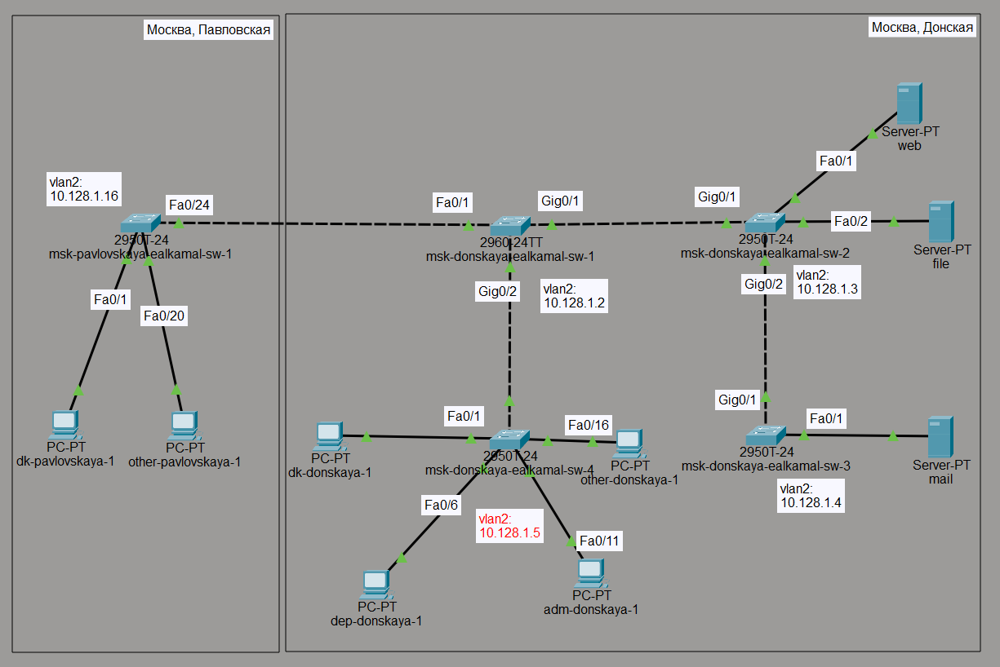
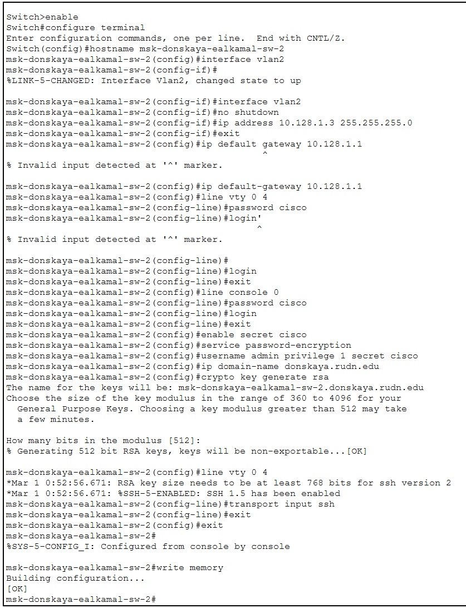
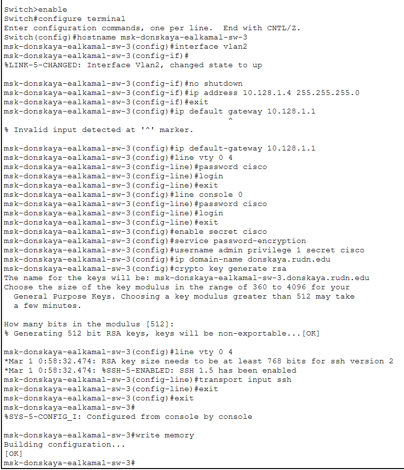

---
## Author
author:
  name: Ибрахим Мохсейн Алькамаль
  degrees: Student (3 курс)
  orcid: ""
  email: 1032225432@rudn.ru
  affiliation:
    - name: Российский университет дружбы народов
      country: Российская Федерация
      postal-code: 117198
      city: Москва
      address: ул. Миклухо-Маклая, д. 6

## Title
title: "Отчёт по лабораторной работе №4"
subtitle: "Администрирование локальных сетей"
license: "CC BY"
---

# Цель работы

Провести подготовительную работу по первоначальной настройке сетевых коммутаторов и ознакомиться с основными принципами управления сетевым оборудованием. В ходе выполнения работы студенты также знакомятся с основными возможностями подготовки отчётов с использованием разметки Markdown и инструментов документирования.

Основные принципы взаимодействия сетевых устройств рассматриваются в рамках модели взаимодействия открытых систем OSI, которая стандартизирована международным стандартом ISO @gost7498.


# Выполнение лабораторной работы

## Размещение устройств и топология сети

В логической рабочей области симулятора размещены коммутаторы, рабочие станции и серверы в соответствии с заданной топологией сети.

Сеть разделена на два сегмента:

- Москва, Павловская
- Москва, Донская

Соединения между коммутаторами выполнены через интерфейсы FastEthernet и GigabitEthernet.

Для управления коммутаторами используется интерфейс VLAN2, которому назначаются IP-адреса из сети 10.128.1.0/24. Использование виртуальных локальных сетей (VLAN) позволяет логически разделять сеть и организовывать управление устройствами на канальном уровне модели OSI @ieee8021q.

{#fig-1 width=70%}


## Первоначальная настройка коммутатора msk-donskaya-ealkamal-sw-1

В командной строке (CLI) коммутатора выполнена базовая конфигурация.

В ходе настройки были выполнены следующие действия:

- установлено имя устройства;
- настроен интерфейс VLAN2 с IP-адресом 10.128.1.2/24;
- интерфейс активирован командой `no shutdown`;
- задан шлюз по умолчанию 10.128.1.1;
- настроен доступ через виртуальные терминалы (VTY) и консоль;
- задан пароль доступа `cisco`;
- создан пользователь admin;
- включено шифрование паролей;
- настроено доменное имя donskaya.rudn.edu;
- сгенерированы RSA-ключи;
- разрешён удалённый доступ по протоколу SSH.

Конфигурация сохранена в энергонезависимой памяти устройства.

{#fig-2 width=70%}


## Настройка коммутатора msk-donskaya-ealkamal-sw-2

На втором коммутаторе выполнена аналогичная первоначальная конфигурация.

Были выполнены следующие действия:

- задано имя устройства msk-donskaya-ealkamal-sw-2;
- настроен интерфейс VLAN2 с IP-адресом 10.128.1.3/24;
- установлен шлюз по умолчанию 10.128.1.1;
- настроен доступ по виртуальным терминалам и консоли;
- установлен пароль `cisco`;
- создан пользователь admin;
- включено шифрование паролей;
- настроено доменное имя сети;
- сгенерированы RSA-ключи для SSH.

После завершения настройки конфигурация сохранена.

{#fig-3 width=70%}


## Настройка коммутатора msk-donskaya-ealkamal-sw-3

На коммутаторе msk-donskaya-ealkamal-sw-3 выполнена аналогичная первоначальная настройка.

Интерфейсу VLAN2 назначен IP-адрес 10.128.1.4/24 и он активирован.
Настроены параметры доступа через VTY и консоль, включено шифрование паролей, создан пользователь admin.

Для обеспечения защищённого удалённого доступа были сгенерированы RSA-ключи и включён протокол SSH.

{#fig-4 width=70%}


## Настройка коммутатора msk-donskaya-ealkamal-sw-4

На коммутаторе msk-donskaya-ealkamal-sw-4 выполнена настройка интерфейса управления VLAN2.

Основные параметры:

- IP-адрес: 10.128.1.5/24
- шлюз по умолчанию: 10.128.1.1

Также были настроены:

- линии VTY;
- консольный доступ;
- пароль `cisco`;
- пользователь admin;
- шифрование паролей;
- доменное имя сети;
- RSA-ключи для SSH.

{#fig-5 width=70%}


## Настройка коммутатора msk-pavlovskaya-ealkamal-sw-1

На коммутаторе msk-pavlovskaya-ealkamal-sw-1 выполнена аналогичная базовая конфигурация.

Интерфейсу VLAN2 назначен IP-адрес:

10.128.1.16/24

Были выполнены следующие действия:

- настройка шлюза по умолчанию;
- настройка доступа через VTY;
- настройка консольного доступа;
- создание пользователя admin;
- генерация RSA-ключей;
- включение удалённого доступа SSH.

Данный подход обеспечивает централизованное управление сетевыми устройствами.

{#fig-6 width=70%}


# Выводы

В ходе лабораторной работы была выполнена первоначальная настройка сетевых коммутаторов.

Для каждого устройства были:

- заданы уникальные имена;
- назначены IP-адреса управления на интерфейсе VLAN2;
- настроены параметры доступа через консоль и VTY;
- включено шифрование паролей;
- создан пользователь администратора.

Также были сгенерированы RSA-ключи и настроен удалённый доступ по протоколу SSH, что обеспечивает защищённое администрирование сетевых устройств.

Логическая организация сети и её сегментация реализуются с использованием технологии VLAN @ieee8021q, а взаимодействие сетевых устройств рассматривается в рамках модели OSI @gost7498.
Принципы маршрутизации сетевого уровня описываются в документации RFC, например в спецификации протокола OSPF @rfc2328.


# Ответы на контрольные вопросы

### 1. При помощи каких команд можно посмотреть конфигурацию сетевого оборудования?

```
show running-config
```

### 2. При помощи каких команд можно посмотреть стартовый конфигурационный файл оборудования?

```
show startup-config
```

### 3. При помощи каких команд можно экспортировать конфигурационный файл оборудования?

```
copy running-config startup-config
copy running-config flash
```

### 4. При помощи каких команд можно импортировать конфигурационный файл оборудования?

```
copy startup-config running-config
copy flash running-config
```


# Список литературы{.unnumbered}

::: {#refs}
:::
