---
## Author
author:
  name: Ибрахим Мохсейн Алькамаль
  degrees: Student (3 курс)
  orcid: ""
  email: 1032225432@rudn.ru
  affiliation:
    - name: Российский университет дружбы народов
      country: Российская Федерация
      postal-code: 117198
      city: Москва
      address: ул. Миклухо-Маклая, д. 6
## Title
title: Лабораторная работа №5
subtitle: Администрирование локальных сетей
license: CC BY
date: today
date-format: "YYYY-MM-DD" # Example: 2025-09-06
---

# Информация

## Докладчик

:::::::::::::: {.columns align=center}
::: {.column width="70%"}

  * Ибрахим Мохсейн Алькамаль
  * Российский университет дружбы народов

:::
::: {.column width="30%"}

:::
::::::::::::::

# Цель работы
Получить основные навыки по настройке VLAN на коммутаторах сети.

# "Конфигурирование VLAN"

## Настройка Trunk-портов на коммутаторе msk-donskaya-ealkamal-sw-1

- Настройка Trunk-портов на всех необходимых интерфейсах
- Интерфейсы **Gig0/1**, **Gig0/2** и **Fa0/1** переведены в режим **trunk**
- Протоколы линии успешно поднялись

---

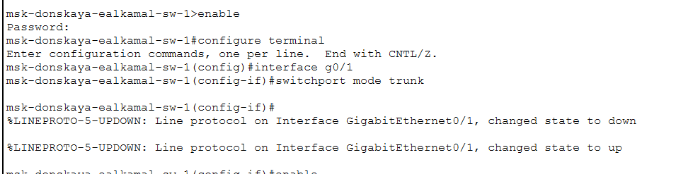{#fig-1 width=70%}

## Настройка оставшихся Trunk-портов на msk-donskaya-ealkamal-sw-1

- Интерфейсы **Gig0/2** и **Fa0/1** сконфигурированы как trunk
- Все соединения с соседними коммутаторами настроены корректно

---

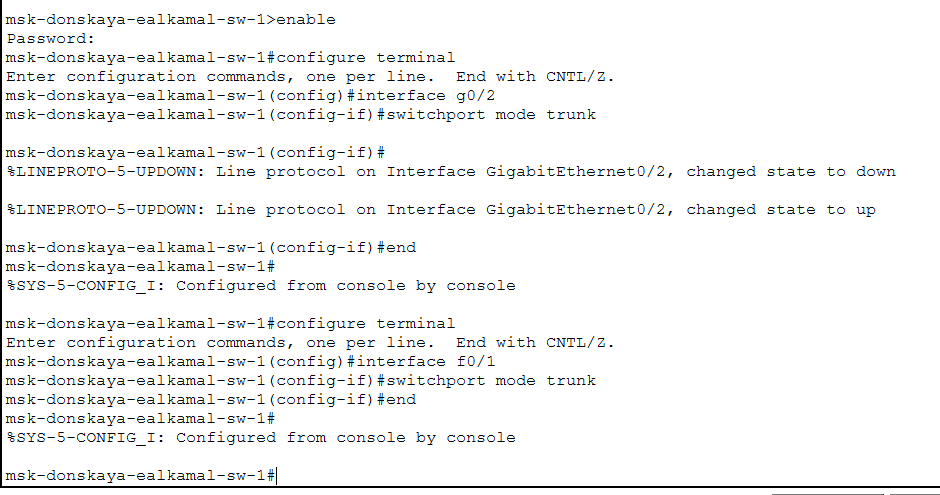{#fig-2 width=70%}

## Настройка VTP сервера и создание VLAN на msk-donskaya-ealkamal-sw-1

- Коммутатор настроен как **VTP Server**
- Установлены домен `donskaya` и пароль `cisco`
- Созданы VLAN:
  - **VLAN 2** - `management`
  - **VLAN 3** - `servers`
  - **VLAN 101** - `dk`
  - **VLAN 102** - `departaments`
  - **VLAN 103** - `adm`
  - **VLAN 104** - `other`

---

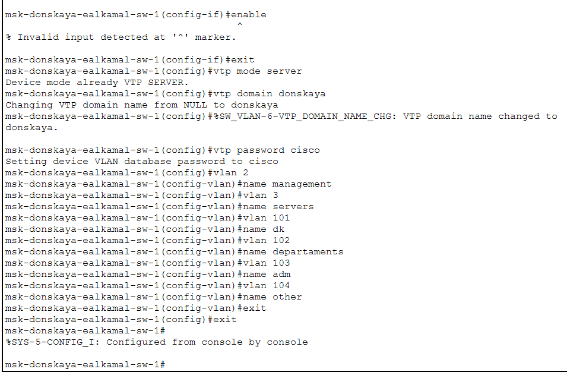{#fig-3 width=70%}

## Настройка Trunk-портов на коммутаторе msk-donskaya-ealkamal-sw-2

- Интерфейс **Gig0/1** (соединение с `-sw-1`) переведён в режим trunk
- Интерфейс **Gig0/2** (соединение с `-sw-3`) переведён в режим trunk

---

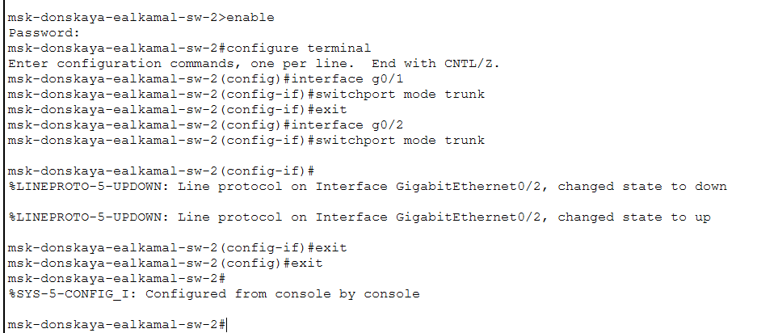{#fig-4 width=70%}

## Настройка Trunk-порта на коммутаторе msk-donskaya-ealkamal-sw-4

- Интерфейс **Gig0/1** (соединение с `msk-donskaya-sw-1`) сконфигурирован как Trunk
- Состояние интерфейса изменилось (ожидаемо до настройки второго конца)

---

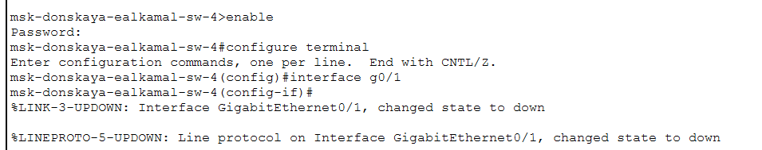{#fig-5 width=70%}

## Настройка Trunk-порта на коммутаторе msk-donskaya-ealkamal-sw-3

- Интерфейс **Gig0/1** (соединение с `msk-donskaya-sw-2`) переведён в режим **trunk**
- Конфигурация выполнена успешно

---

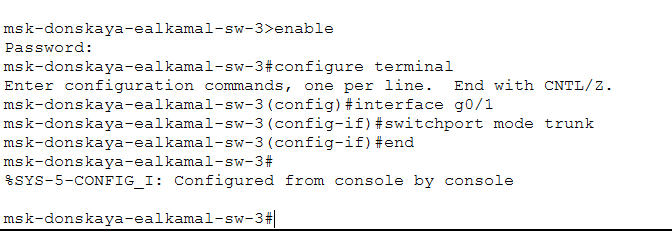{#fig-6 width=70%}

## Настройка Trunk-порта на коммутаторе msk-pavlovskaya-ealkamal-sw-1

- Интерфейс **Fa0/24** (соединение с `msk-donskaya-sw-1`) переведён в режим **trunk**
- Обеспечивает передачу трафика нескольких VLAN между площадками

---

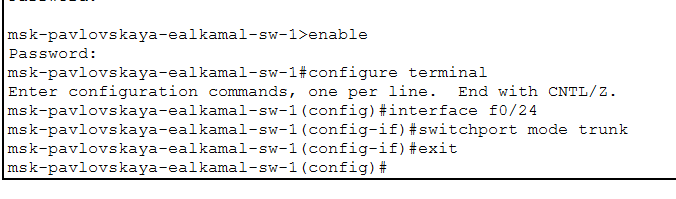{#fig-7 width=70%}

## Настройка VTP клиента и Access-портов на msk-donskaya-ealkamal-sw-2

- Коммутатор настроен как **VTP Client**
- Интерфейсы **Fa0/1** и **Fa0/2** настроены как **access-порты**
- Порта назначены в **VLAN 3 (servers)** для подключения веб-сервера и файлового сервера

---

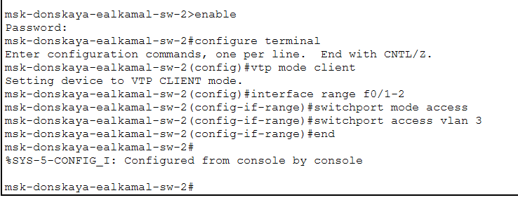{#fig-8 width=70%}

## Настройка VTP клиента и Access-портов на коммутаторе msk-donskaya-ealkamal-sw-4

- Коммутатор настроен как **VTP Client**
- Интерфейсы распределены по VLAN:
  - **Fa0/1 – Fa0/5** → **VLAN 101 (dk)**
  - **Fa0/6 – Fa0/10** → **VLAN 102 (departaments)**
  - **Fa0/11 – Fa0/15** → **VLAN 103 (adm)**
  - **Fa0/16 – Fa0/24** → **VLAN 104 (other)**
- Все интерфейсы переведены в режим **access**

---

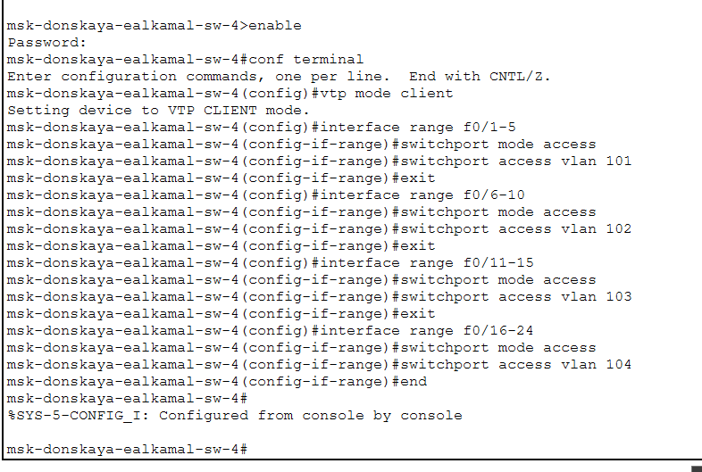{#fig-10 width=70%}

## Настройка VTP клиента на msk-donskaya-ealkamal-sw-3

- Коммутатор настроен как **VTP Client**

---

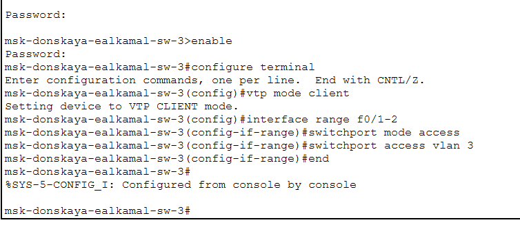{#fig-9 width=70%}

## Настройка VTP клиента и Access-портов на msk-pavlovskaya-ealkamal-sw-1

- Коммутатор настроен как **VTP Client**
- Возникла ошибка при настройке **Fa0/24** (несоответствие типа порта)
- Конфигурация скорректирована:
  - **Fa0/1-15** → **VLAN 101 (dk)**
  - **Fa0/16-23** → подготовлены для соответствующих VLAN

---

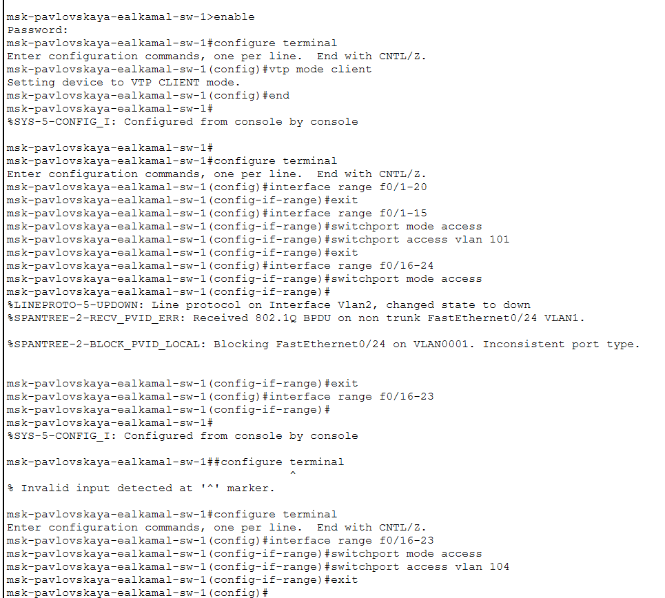{#fig-11 width=70%}

## Настройка IP-адресации на сервере Web

- **IP-адрес:** 10.128.0.2
- **Маска подсети:** 255.255.255.0
- **Шлюз по умолчанию:** 10.128.0.1
- Сервер в **VLAN 3 (servers)**, подключён к `msk-donskaya-sw-2`

---

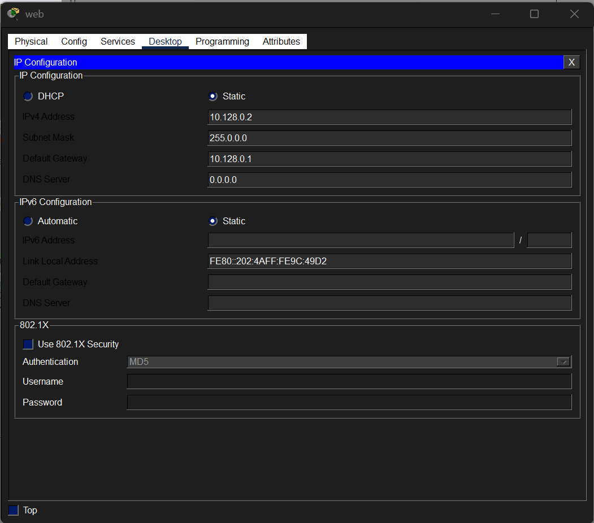{#fig-12 width=70%}

## Настройка IP-адресации на сервере File

- **IP-адрес:** 10.128.0.3
- **Маска подсети:** 255.255.255.0
- **Шлюз по умолчанию:** 10.128.0.1
- Сервер в **VLAN 3 (servers)**, подключён к `msk-donskaya-sw-2`

---

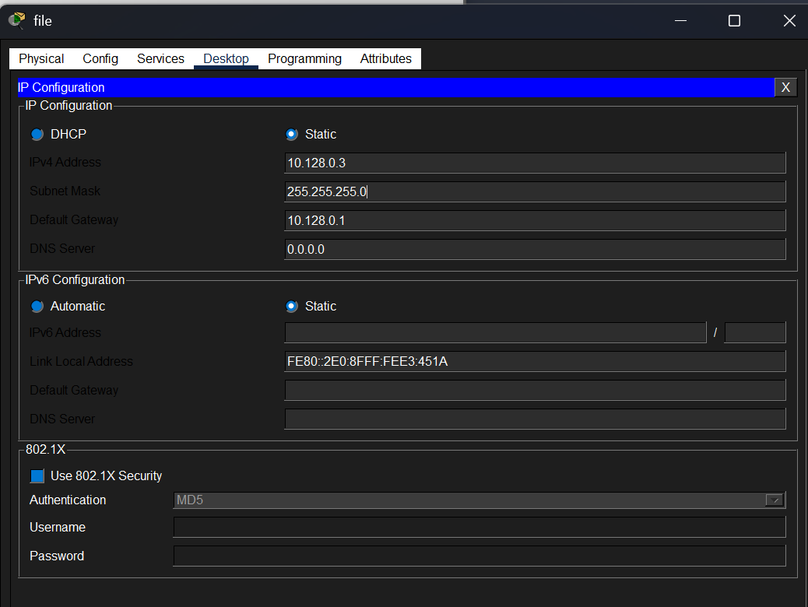{#fig-13 width=70%}

## Настройка IP-адресации на сервере Mail

- **IP-адрес:** 10.128.0.4
- **Маска подсети:** 255.255.255.0
- **Шлюз по умолчанию:** 10.128.0.1
- Сервер в **VLAN 3 (servers)**, подключён к `msk-donskaya-sw-3`

---

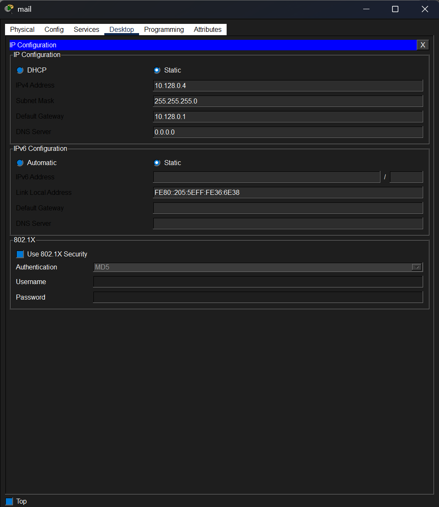{#fig-14 width=70%}

## Настройка IP-адресации на клиентском устройстве dk-donskaya-1

- Устройство в **VLAN 101 (dk)**
- **IP-адрес:** 10.128.3.2
- **Маска подсети:** 255.255.255.0
- **Шлюз по умолчанию:** 10.128.3.1
- Подключено к `msk-donskaya-sw-4` (порт Fa0/1)

---

{#fig-15 width=70%}

## Настройка IP-адресации на клиентском устройстве dep-donskaya-1

- Устройство в **VLAN 102 (departments)**
- **IP-адрес:** 10.128.4.2
- **Маска подсети:** 255.255.255.0
- **Шлюз по умолчанию:** 10.128.4.1
- Подключено к `msk-donskaya-sw-4` (порт Fa0/6)

---

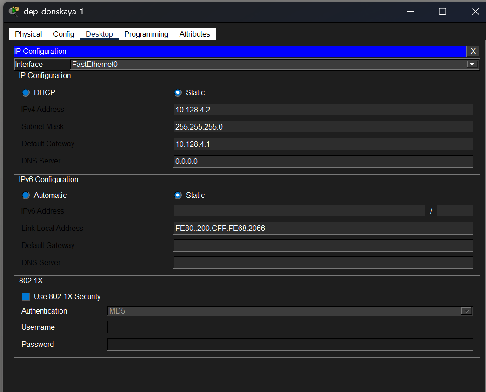{#fig-16 width=70%}

## Настройка IP-адресации на клиентском устройстве adm-donskaya-1

- Устройство в **VLAN 103 (adm)**
- **IP-адрес:** 10.128.5.2
- **Маска подсети:** 255.255.255.0
- **Шлюз по умолчанию:** 10.128.5.1
- Подключено к `msk-donskaya-sw-4` (порт Fa0/11)

---

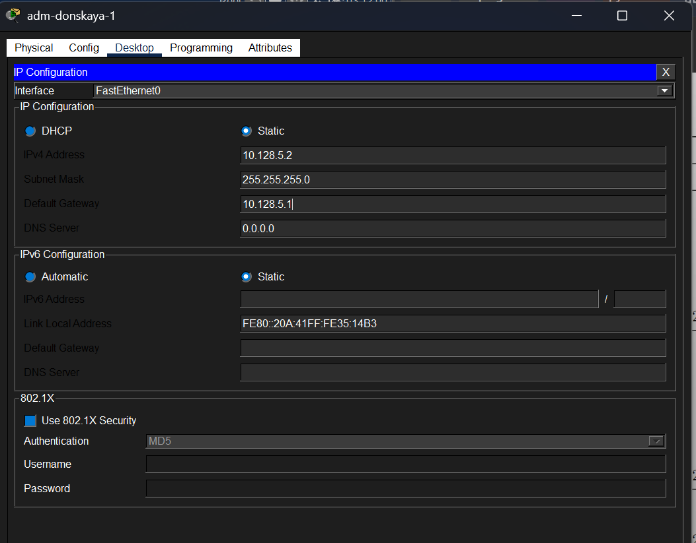{#fig-17 width=70%}

## Настройка IP-адресации на клиентском устройстве other-donskaya-1

- Устройство в **VLAN 104 (other)**
- **IP-адрес:** 10.128.6.2
- **Маска подсети:** 255.255.255.0
- **Шлюз по умолчанию:** 10.128.6.1
- Подключено к `msk-donskaya-sw-4` (порт Fa0/16)

---

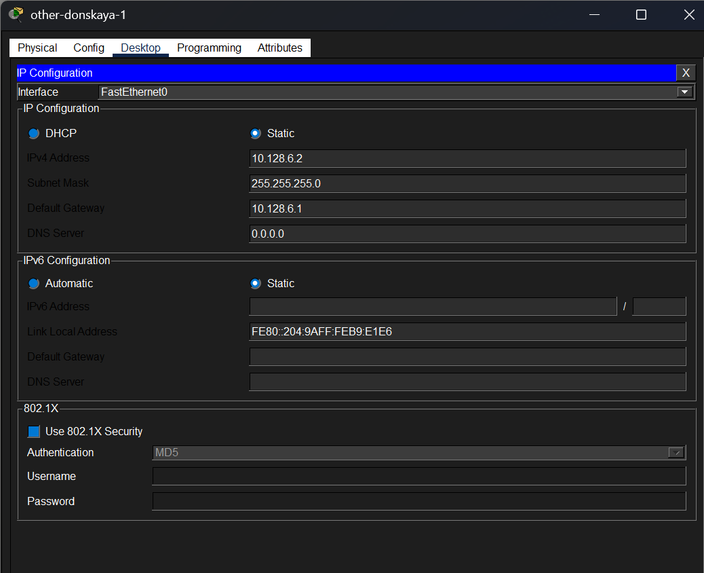{#fig-18 width=70%}

## Настройка IP-адресации на клиентском устройстве dk-pavlovskaya-1

- Устройство в **VLAN 101 (dk)** (площадка "Павловская")
- **IP-адрес:** 10.128.3.10
- **Маска подсети:** 255.255.255.0
- **Шлюз по умолчанию:** 10.128.3.1
- Подключено к `msk-pavlovskaya-sw-1` (порт Fa0/1)

---

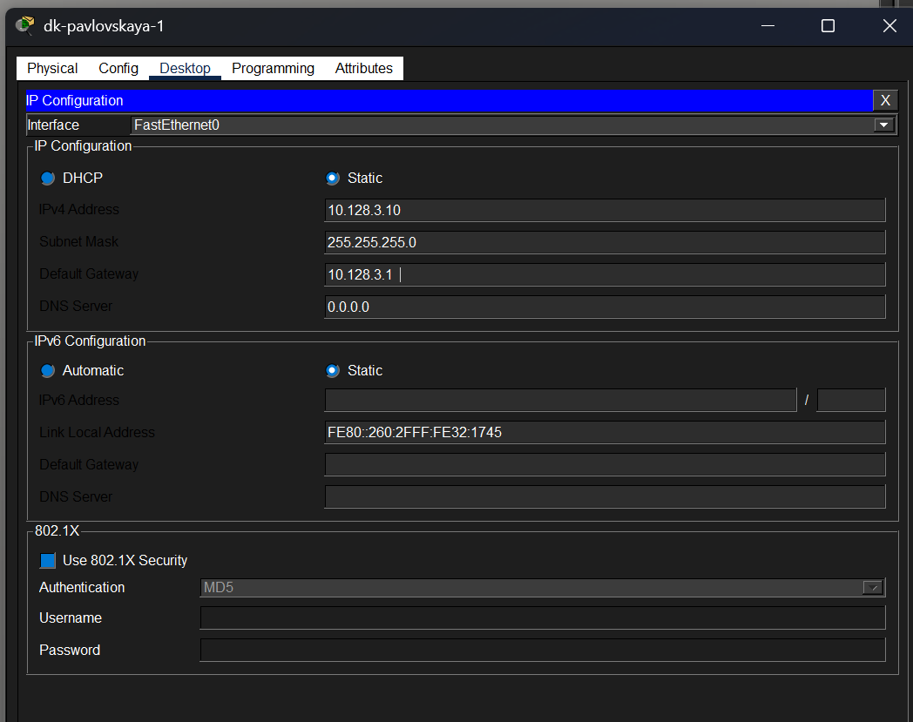{#fig-19 width=70%}

## Настройка IP-адресации на клиентском устройстве other-pavlovskaya-1

- Устройство в **VLAN 104 (other)** (площадка "Павловская")
- **IP-адрес:** 10.128.6.10
- **Маска подсети:** 255.255.255.0
- **Шлюз по умолчанию:** 10.128.6.1
- Подключено к `msk-pavlovskaya-sw-1` (порт Fa0/20)

---

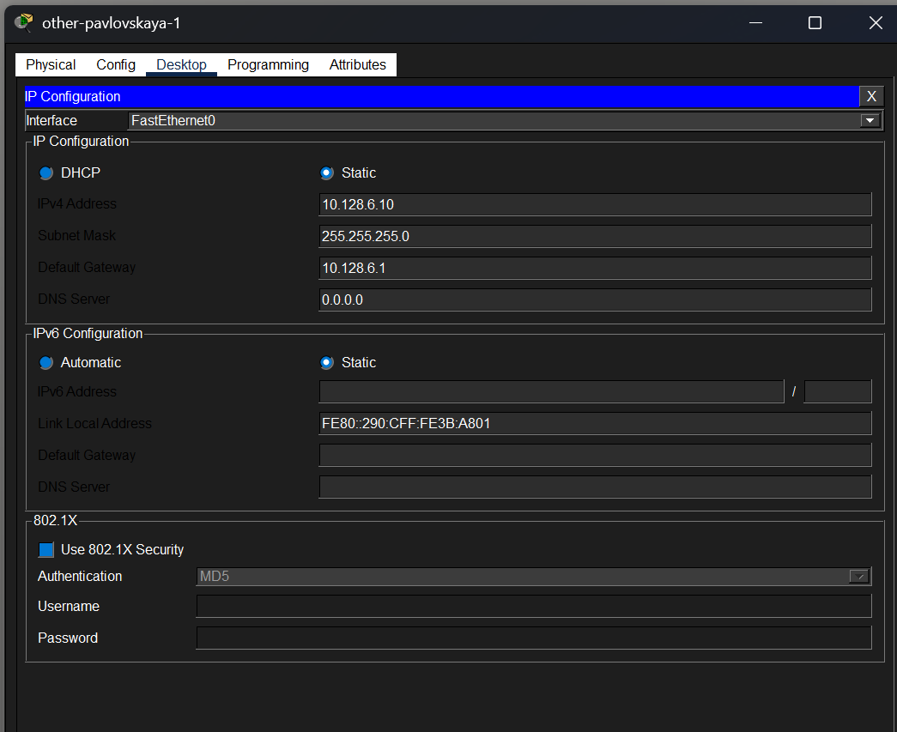{#fig-20 width=70%}

# Проверка доступности устройств (Результаты тестирования)

## Анализ работы протокола STP в сети

- Проверка работы протокола **STP (Spanning Tree Protocol)**
- В Simulation Panel отображается обмен **BPDU-кадрами** между коммутаторами
- STP автоматически определяет:
  - **Корневой коммутатор (Root Bridge)**
  - **Корневые порты (Root Ports)**
  - **Назначенные порты (Designated Ports)**
- Блокирует избыточные соединения для предотвращения петель
- Обеспечивает стабильную работу сети и предотвращает широковещательные штормы

---

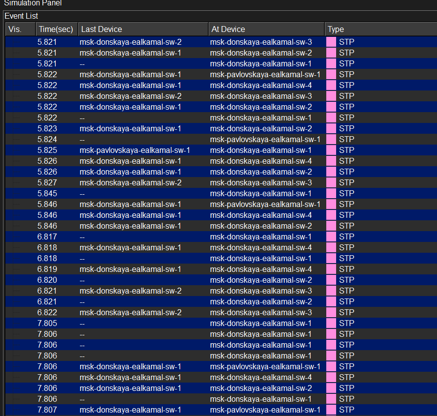{#fig-21 width=70%}

# Выводы

**Выполнены следующие задачи:**
- Настройка Trunk-портов между коммутаторами
- Настройка VTP-сервера и VTP-клиентов
- Создание необходимых VLAN (2, 3, 101-104)
- Назначение Access-портов в соответствующие VLAN
- Настройка IP-адресации на серверах и ПК

**Результаты проверки доступности:**
-  Устройства внутри одного VLAN доступны
-  Устройства из разных VLAN взаимодействуют через маршрутизатор

**Все поставленные задачи выполнены успешно.**