---
## Author
author:
  name: Ибрахим Мохсейн Алькамаль
  degrees: Student (3 курс)
  orcid: ""
  email: 1032225432@rudn.ru
  affiliation:
    - name: Российский университет дружбы народов
      country: Российская Федерация
      postal-code: 117198
      city: Москва
      address: ул. Миклухо-Маклая, д. 6
## Title
title: Лабораторная работа №6
subtitle: Администрирование локальных сетей
license: CC BY
date: today
date-format: "YYYY-MM-DD" # Example: 2025-09-06
---

# Информация

## Докладчик

:::::::::::::: {.columns align=center}
::: {.column width="70%"}

  * Ибрахим Мохсейн Алькамаль
  * Российский университет дружбы народов
  * [GitHub](https://github.com/Ebrahimalkamal2027)

:::
::: {.column width="30%"}

:::
::::::::::::::
# Цель работы

- Настроить статическую маршрутизацию VLAN в сети

# Выполнение лабораторной работы

## 1. Размещение и подключение маршрутизатора

- Размещён маршрутизатор Cisco 2811
- Подключён к msk-donskaya-ealkamal-sw-1
- Использован интерфейс FastEthernet0/0 → FastEthernet0/24
- Топология соответствует структуре сети с VLAN

---

{#fig-1 width=70%}

## 2. Первичная настройка маршрутизатора

- Задано имя устройства
- Настроены пароли (console и vty)
- Включено шифрование паролей
- Создан пользователь
- Сгенерированы RSA-ключи
- Настроен доступ по SSH

---

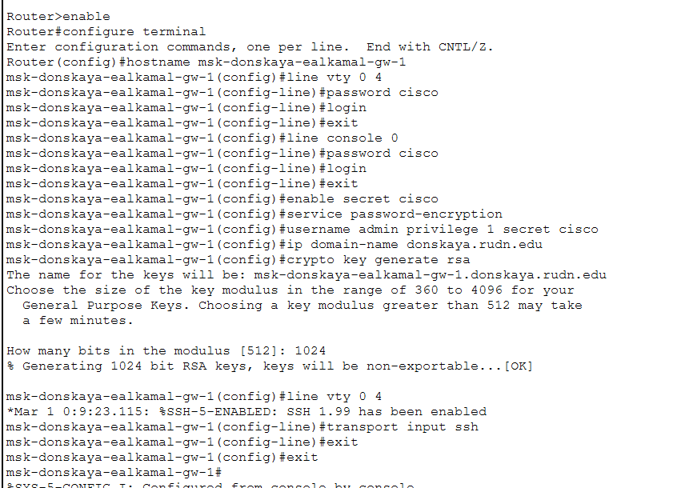{#fig-2 width=70%}

## 3. Настройка trunk-порта на коммутаторе

- Интерфейс FastEthernet0/24 переведён в режим trunk
- Обеспечена передача нескольких VLAN

---

{#fig-3 width=70%}

## 4. Активация интерфейса маршрутизатора

- Интерфейс FastEthernet0/0 активирован
- Выполнена команда no shutdown
- Интерфейс перешёл в состояние up

---

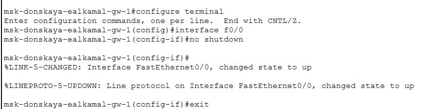{#fig-4 width=70%}

## 5. Настройка подинтерфейса VLAN 2

- Создан интерфейс FastEthernet0/0.2
- Настроена encapsulation dot1Q 2
- Назначен IP 10.128.1.1/24
- Используется как шлюз VLAN 2

---

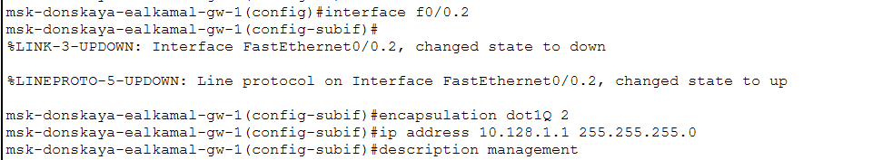{#fig-5 width=70%}

## 6. Настройка подинтерфейса VLAN 3

- Создан интерфейс FastEthernet0/0.3
- Настроена encapsulation dot1Q 3
- Назначен IP 10.128.0.1/24

---

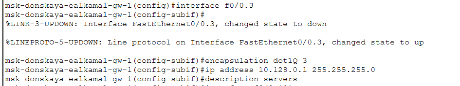{#fig-6 width=70%}

## 7. Настройка подинтерфейсов VLAN 101–104

- Созданы интерфейсы FastEthernet0/0.101–104
- Настроена encapsulation dot1Q для каждой VLAN
- Назначены IP-адреса
- Обеспечена маршрутизация между VLAN

---

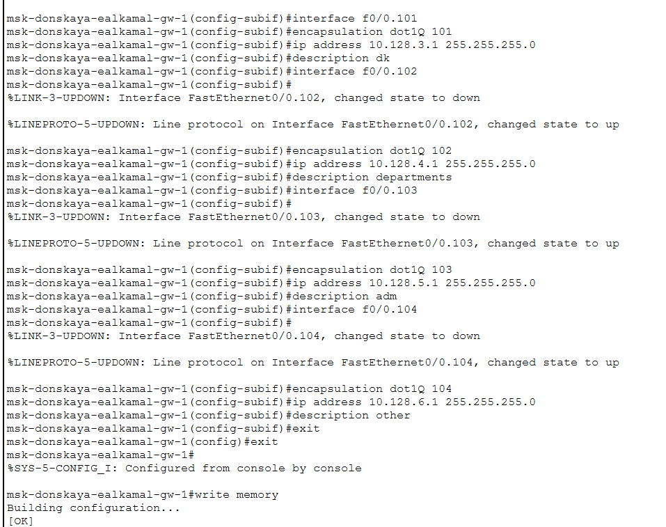{#fig-7 width=70%}

## 8. Проверка состояния интерфейсов

- Выполнена команда show ip interface brief
- Все подинтерфейсы в состоянии up
- Конфигурация корректна

---

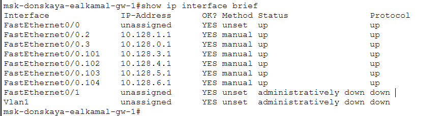{#fig-8 width=70%}

## 9. Проверка доступности устройств (VLAN 101 → VLAN 102)

- Выполнен ping с dk-donskaya-1
- Проверка адреса 10.128.4.2
- Получены ответы

---

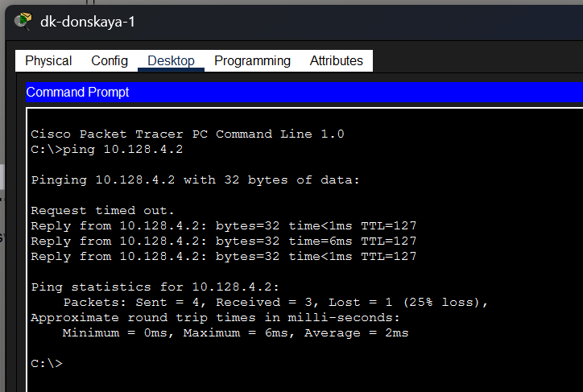{#fig-9 width=70%}

## 10. Проверка доступности устройств (VLAN 102 → VLAN 103)

- Выполнен ping с dep-donskaya-1
- Проверка адреса 10.128.5.2
- Получены ответы

---

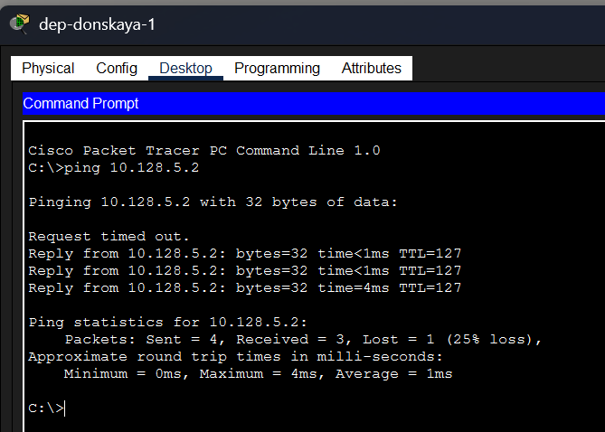{#fig-10 width=70%}

## 11. Проверка доступности устройств (VLAN 103 → VLAN 104)

- Выполнен ping с adm-donskaya-1
- Проверка адреса 10.128.6.2
- Получены ответы

---

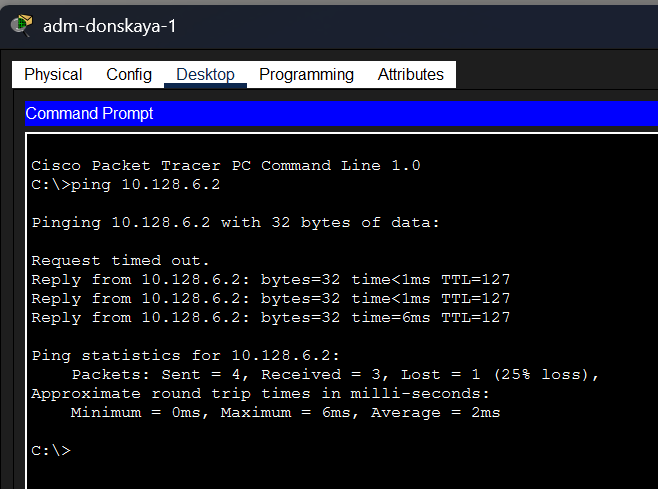{#fig-11 width=70%}

## 12. Проверка доступности устройств (VLAN 104 → VLAN 101)

- Выполнен ping с other-donskaya-1
- Проверка адреса 10.128.3.2
- Потерь пакетов нет

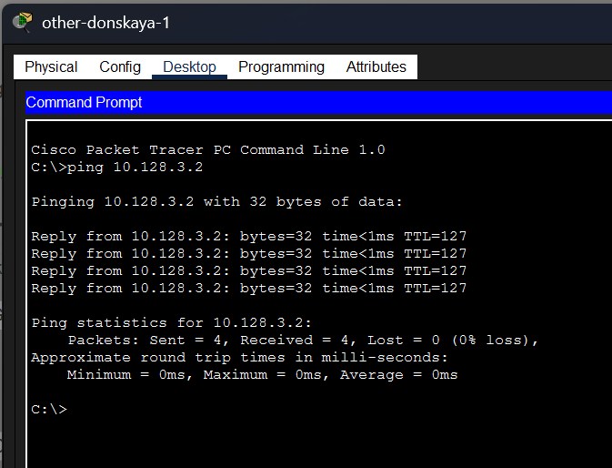{#fig-12 width=70%}

## 13. Анализ передачи пакета в режиме Simulation

- Использован режим Simulation
- Отслежен путь ICMP-пакета
- Пакет проходит через коммутаторы
- Обрабатывается маршрутизатором
- Используются trunk-соединения

---

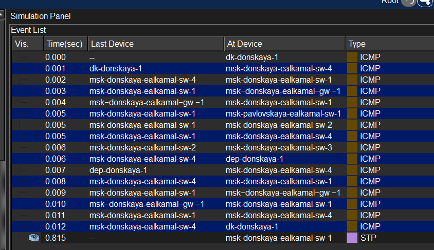{#fig-13 width=70%}

# Выводы

- Добавлен и настроен маршрутизатор Cisco 2811
- Настроен trunk между коммутатором и маршрутизатором
- Реализованы подинтерфейсы VLAN (802.1Q) 
- Интерфейсы находятся в состоянии up
- Связь между VLAN подтверждена ping
- Передача пакетов соответствует модели OSI 
- Используются принципы маршрутизации IP-сетей 
