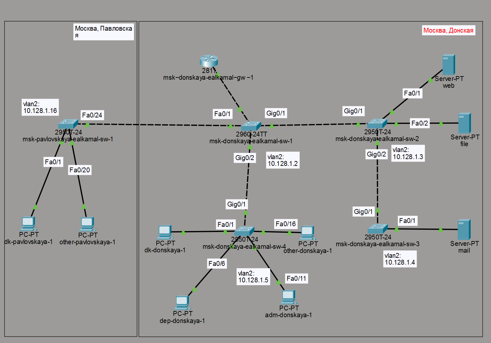
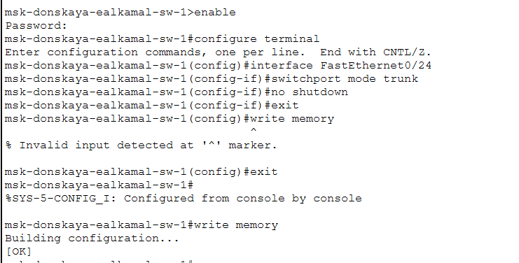

---
## Author
author:
  name: Ибрахим Мохсейн Алькамаль
  degrees: Student (3 курс)
  orcid: ""
  email: 1032225432@rudn.ru
  affiliation:
    - name: Российский университет дружбы народов
      country: Российская Федерация
      postal-code: 117198
      city: Москва
      address: ул. Миклухо-Маклая, д. 6

## Title
title: "Отчёт по лабораторной работе №6"
subtitle: "Администрирование локальных сетей"
license: "CC BY"
---

# Цель работы

Настроить статическую маршрутизацию VLAN в сети.

# Задание

1. В логической области проекта разместить маршрутизатор Cisco 2811, подключить его к порту 24 коммутатора msk-donskaya-sw-1 в соответствии
с таблицей портов (см. табл. 3.3 из раздела 3.3).
2. Используя приведённую ниже последовательность команд по первоначальной настройке маршрутизатора, сконфигурируйте маршрутизатор, задав на
нём имя, пароль для доступа к консоли, настройте удалённое подключение
к нему по ssh.
3. Настройте порт 24 коммутатора msk-donskaya-sw-1 как trunk-порт.
4. На интерфейсе f0/0 маршрутизатора msk-donskaya-gw-1 настройте виртуальные интерфейсы, соответствующие номерам VLAN. Согласно таблице IP-адресов (см. табл. 3.2 из раздела 3.3) задайте соответствующие IP-адреса на виртуальных интерфейсах. Для этого используйте приведённую ниже последовательность команд по конфигурации VLAN-интерфейсов маршрутизатора.
5. Проверьте доступность оконечных устройств из разных VLAN.
6. Используя режим симуляции в Packet Tracer, изучите процесс передвижения пакета ICMP по сети. Изучите содержимое передаваемого пакета и заголовки задействованных протоколов.

# Выполнение лабораторной работы

## Размещение и подключение маршрутизатора

В логической области проекта размещён маршрутизатор Cisco 2811 и подключён к коммутатору msk-donskaya-ealkamal-sw-1 через интерфейс FastEthernet0/0 к порту FastEthernet0/24. Топология сети соответствует заданной структуре с несколькими VLAN и распределёнными коммутаторами ([рис. @fig-1]).

{#fig-1 width=70%}

## Первичная настройка маршрутизатора

На маршрутизаторе выполнена базовая конфигурация: задано имя устройства, настроены пароли для консоли и удалённого доступа, включено шифрование паролей, создан пользователь и сгенерированы RSA-ключи для работы SSH ([рис. @fig-2]).

{#fig-2 width=70%}

## Настройка trunk-порта на коммутаторе

На коммутаторе msk-donskaya-ealkamal-sw-1 интерфейс FastEthernet0/24 переведён в режим trunk для передачи трафика нескольких VLAN между коммутатором и маршрутизатором ([рис. @fig-3]).

{#fig-3 width=70%}

## Активация интерфейса маршрутизатора

Интерфейс FastEthernet0/0 маршрутизатора активирован командой no shutdown, что обеспечило переход интерфейса в состояние up и готовность к работе ([рис. @fig-4]).

{#fig-4 width=70%}

## Настройка подинтерфейса VLAN 2

Создан подинтерфейс FastEthernet0/0.2, настроена инкапсуляция dot1Q для VLAN 2 и назначен IP-адрес 10.128.1.1/24, соответствующий шлюзу данной сети ([рис. @fig-5]).

{#fig-5 width=70%}

## Настройка подинтерфейса VLAN 3

Создан подинтерфейс FastEthernet0/0.3 с инкапсуляцией dot1Q для VLAN 3 и назначен IP-адрес 10.128.0.1/24 ([рис. @fig-6]).

{#fig-6 width=70%}

## Настройка подинтерфейсов VLAN 101–104

Настроены подинтерфейсы FastEthernet0/0.101–FastEthernet0/0.104 с соответствующей инкапсуляцией dot1Q и IP-адресами для каждой VLAN, что обеспечивает маршрутизацию между сетями ([рис. @fig-7]).

{#fig-7 width=70%}

## Проверка состояния интерфейсов

С помощью команды show ip interface brief проверено состояние всех интерфейсов маршрутизатора. Все подинтерфейсы находятся в состоянии up, что подтверждает корректность настройки ([рис. @fig-8]).

{#fig-8 width=70%}

## Проверка доступности устройств (VLAN 101 → VLAN 102)

С устройства dk-donskaya-1 выполнена команда ping до адреса 10.128.4.2. Получены ответы от удалённого устройства, что подтверждает работу маршрутизации между VLAN ([рис. @fig-9]).

{#fig-9 width=70%}

## Проверка доступности устройств (VLAN 102 → VLAN 103)

С устройства dep-donskaya-1 выполнена проверка соединения с адресом 10.128.5.2. Ответы получены, связь между VLAN функционирует ([рис. @fig-10]).

{#fig-10 width=70%}

## Проверка доступности устройств (VLAN 103 → VLAN 104)

С устройства adm-donskaya-1 выполнена проверка соединения с адресом 10.128.6.2. Ответы получены, что подтверждает корректную маршрутизацию ([рис. @fig-11]).

{#fig-11 width=70%}

## Проверка доступности устройств (VLAN 104 → VLAN 101)

С устройства other-donskaya-1 выполнена проверка соединения с адресом 10.128.3.2. Потерь пакетов не наблюдается, связь полностью установлена ([рис. @fig-12]).

{#fig-12 width=70%}

## Анализ передачи пакета в режиме Simulation

В режиме Simulation прослежен путь ICMP-пакета через коммутаторы и маршрутизатор. Пакет проходит через trunk-соединения и обрабатывается маршрутизатором, что подтверждает корректную работу межвлановой маршрутизации ([рис. @fig-13]).

{#fig-13 width=70%}

# Выводы

В ходе выполнения лабораторной работы был добавлен и настроен маршрутизатор Cisco 2811, подключённый к коммутатору через trunk-порт. На маршрутизаторе выполнена базовая конфигурация и настроены подинтерфейсы для VLAN с использованием инкапсуляции IEEE 802.1Q [@ieee8021q].

Проверка состояния интерфейсов показала их корректную работу (состояние up). Тестирование с помощью команды ping подтвердило доступность устройств между различными VLAN, что свидетельствует о правильной настройке межвлановой маршрутизации.

Анализ в режиме Simulation показал прохождение ICMP-пакетов через коммутаторы и маршрутизатор, что соответствует принципам функционирования сетевых протоколов и модели взаимодействия открытых систем [@gost7498], а также использованию протоколов маршрутизации в IP-сетях [@rfc2328].

# Контрольные вопросы

## Охарактеризуйте стандарт IEEE 802.1Q

Стандарт IEEE 802.1Q определяет механизм виртуальных локальных сетей (VLAN) на канальном уровне модели OSI. Он позволяет разделять физическую сеть на логические сегменты путём добавления специального тега в Ethernet-кадр. Этот тег используется для идентификации VLAN и передачи трафика нескольких VLAN через один физический канал (trunk) [@ieee8021q].

## Опишите формат кадра IEEE 802.1Q

Кадр IEEE 802.1Q представляет собой расширенный Ethernet-кадр, в который добавляется тег длиной 4 байта между MAC-адресом источника и полем типа протокола.

Тег включает:
- TPID (2 байта) — идентификатор тега (0x8100);
- TCI (2 байта), содержащий:
  - приоритет (3 бита),
  - CFI/DEI (1 бит),
  - VLAN ID (12 бит).

Добавление данного тега позволяет устройствам сети корректно обрабатывать трафик различных VLAN и обеспечивать их маршрутизацию [@ieee8021q].

# Список литературы{.unnumbered}

::: {#refs}
:::
