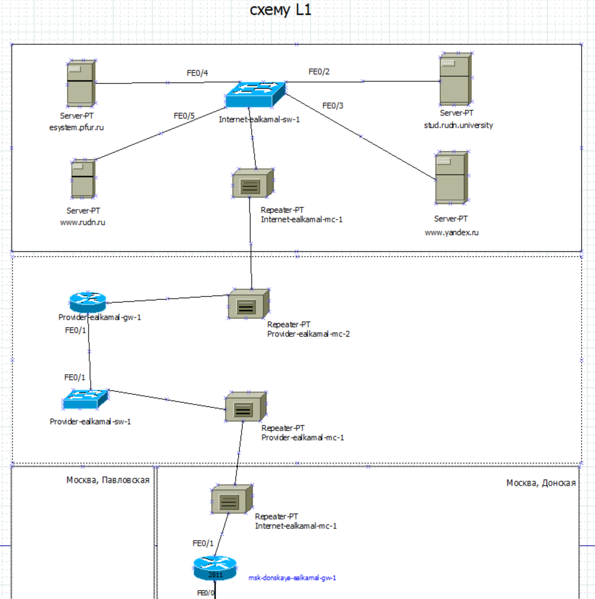
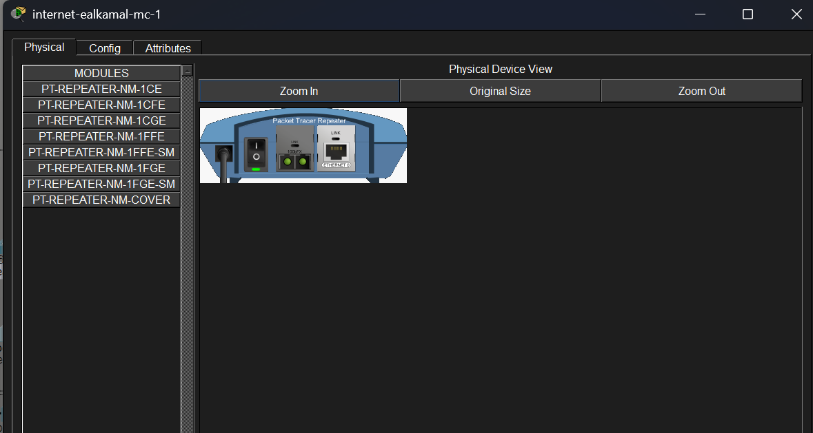
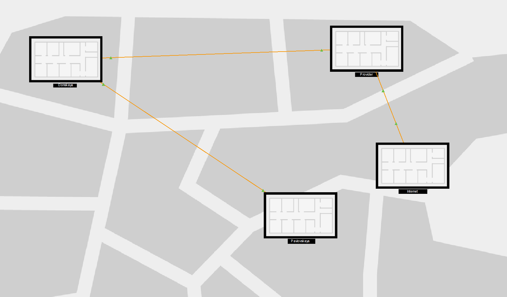
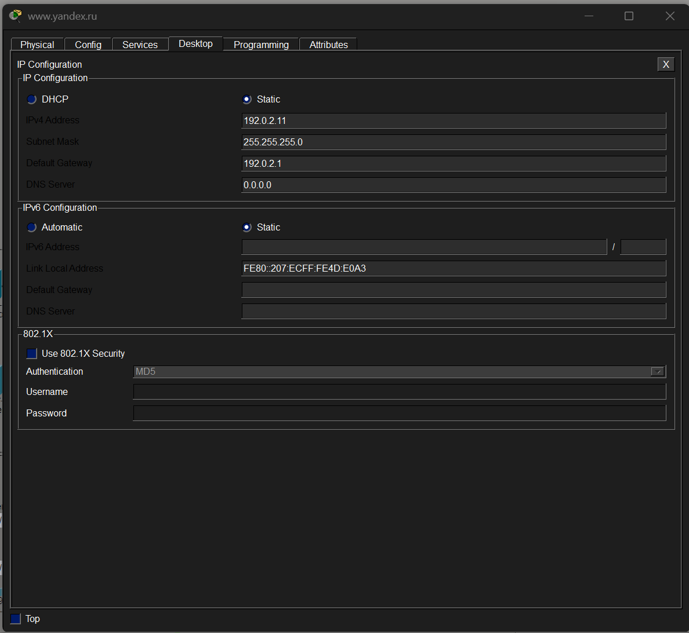
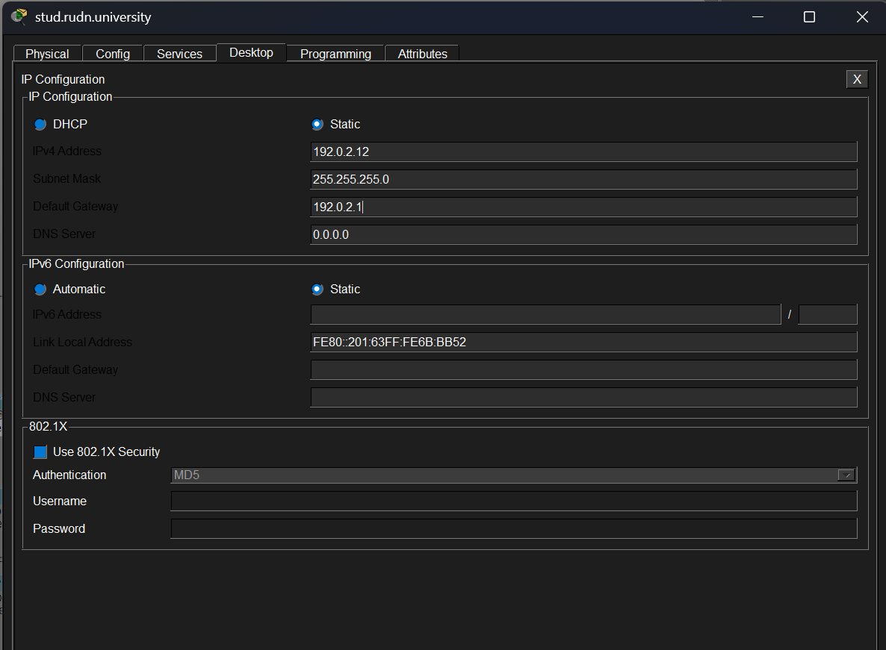
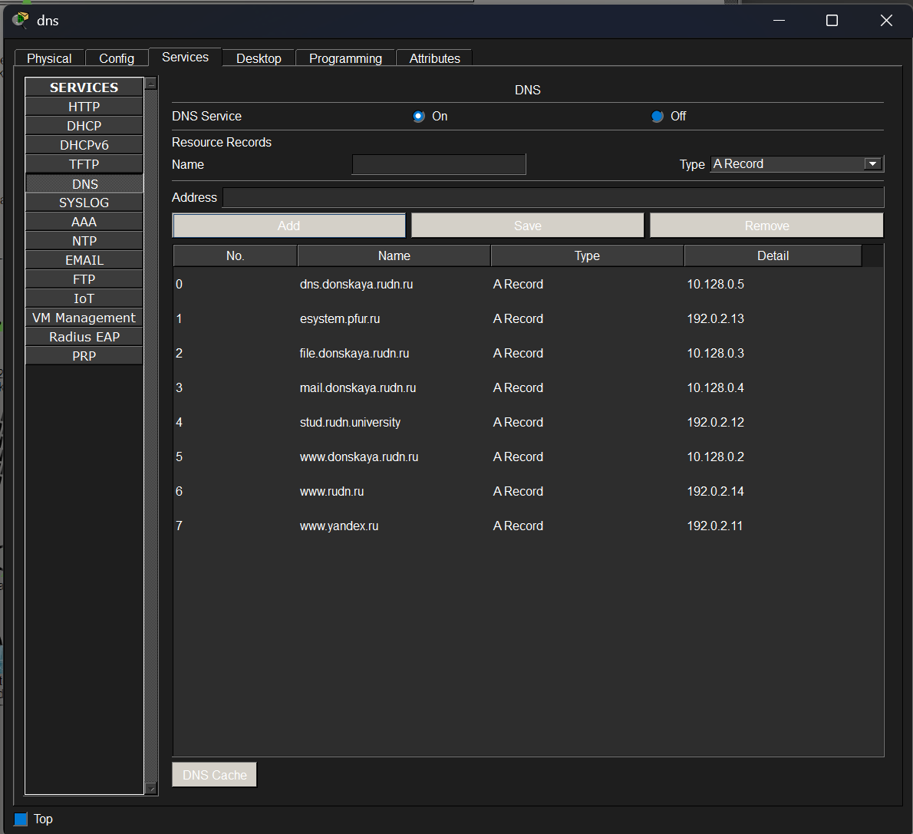
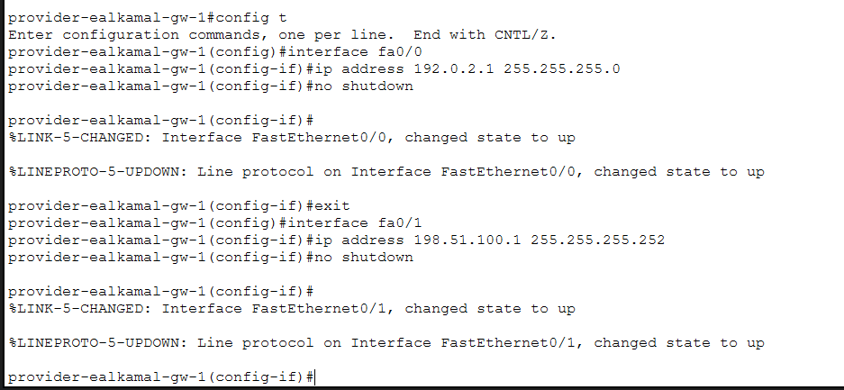

---
## Author
author:
  name: Ибрахим Мохсейн Алькамаль
  degrees: Student (3 курс)
  orcid: ""
  email: 1032225432@rudn.ru
  affiliation:
    - name: Российский университет дружбы народов
      country: Российская Федерация
      postal-code: 117198
      city: Москва
      address: ул. Миклухо-Маклая, д. 6
## Title
title: Лабораторная работа №11
subtitle: Администрирование локальных сетей
license: CC BY
date: today
date-format: "YYYY-MM-DD" # Example: 2025-09-06
---

# Информация

## Докладчик

:::::::::::::: {.columns align=center}
::: {.column width="70%"}

  - Ибрахим Мохсейн Алькамаль
  - Российский университет дружбы народов
  - [GitHub](https://github.com/Ebrahimalkamal2027)

:::
::: {.column width="30%"}

:::
::::::::::::::

# Цель работы

Провести подготовительные мероприятия по подключению локальной сети
организации к Интернету.

# Выполнение лабораторной работы

## Построение схемы L1

- Сформирована физическая топология сети уровня L1
- Включены сегменты: Интернет, провайдер, локальная сеть
- Коммутатор подключает серверы по FastEthernet
- Использован медиаконвертер для связи с провайдером

{#fig-1 width=70%}

## Детализация соединений в сегменте Интернета

- Серверы подключены к коммутатору через Fa0/2–Fa0/5
- Соединение с провайдером через медиаконвертер
- Отображены направления передачи данных

---

{#fig-2 width=70%}

## Настройка медиаконвертера

- Выбраны модули для Fast Ethernet
- Настроены модули для оптоволоконного соединения
- Обеспечена передача данных между сегментами

---

{#fig-3 width=70%}

## Размещение сети в физической области

- Сеть распределена по физической области
- Добавлены здания: Donская, Павловская, провайдер, Интернет
- Организованы соединения между зданиями

---

{#fig-4 width=70%}

## Настройка IP-адреса сервера www.yandex.ru

- Назначен статический IP: 192.0.2.11
- Маска: 255.255.255.0
- Шлюз: 192.0.2.1

---

{#fig-5 width=70%}

## Настройка IP-адреса сервера www.rudn.ru

- Назначен статический IP: 192.0.2.14
- Маска: 255.255.255.0
- Шлюз: 192.0.2.1

---

{#fig-6 width=70%}

## Настройка IP-адреса сервера stud.rudn.university

- Назначен статический IP: 192.0.2.12
- Маска: 255.255.255.0
- Шлюз: 192.0.2.1

---

{#fig-7 width=70%}

## Настройка IP-адреса сервера esystem.pfur.ru

- Назначен статический IP: 192.0.2.13
- Маска: 255.255.255.0
- Шлюз: 192.0.2.1

---

{#fig-8 width=70%}

---

## Настройка DNS-сервера

- Добавлены записи типа A
- Настроены записи для внутренних и внешних серверов
- Указаны соответствующие IP-адреса

---

{#fig-9 width=70%}

## Настройка интерфейсов маршрутизатора провайдера

- Настроен интерфейс Fa0/0: 192.0.2.1/24
- Настроен интерфейс Fa0/1: 198.51.100.1/30
- Обеспечено соединение с Интернетом и локальной сетью

---

{#fig-10 width=70%}

## Настройка интерфейса маршрутизатора локальной сети

- Настроен интерфейс Fa0/1
- Назначен IP: 198.51.100.2/30
- Обеспечено подключение к провайдеру

---

{#fig-11 width=70%}

# Выводы

В ходе выполнения работы была построена модель сети с подключением к провайдеру и сети Интернет, включая настройку физической топологии, соединений и адресации узлов. Были назначены статические IP-адреса серверам модельной сети и настроено взаимодействие между сегментами сети через маршрутизаторы.
