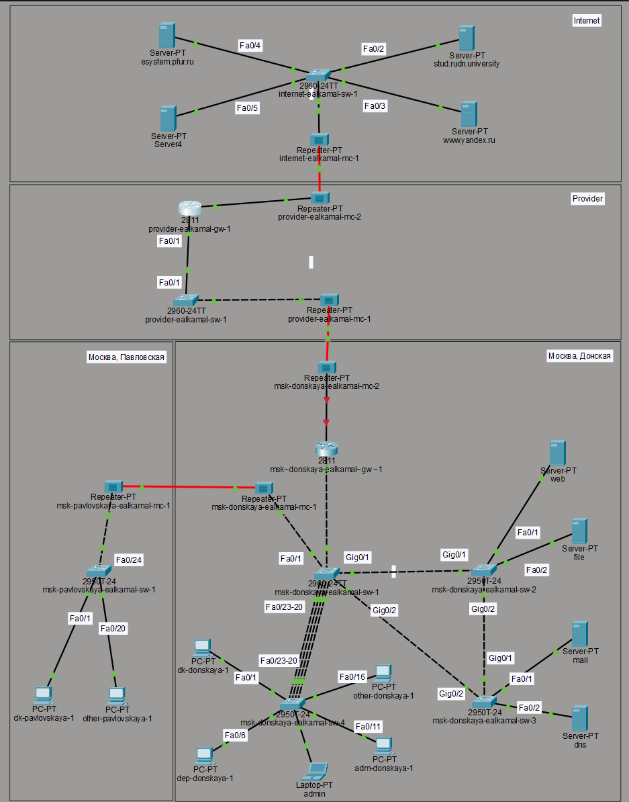
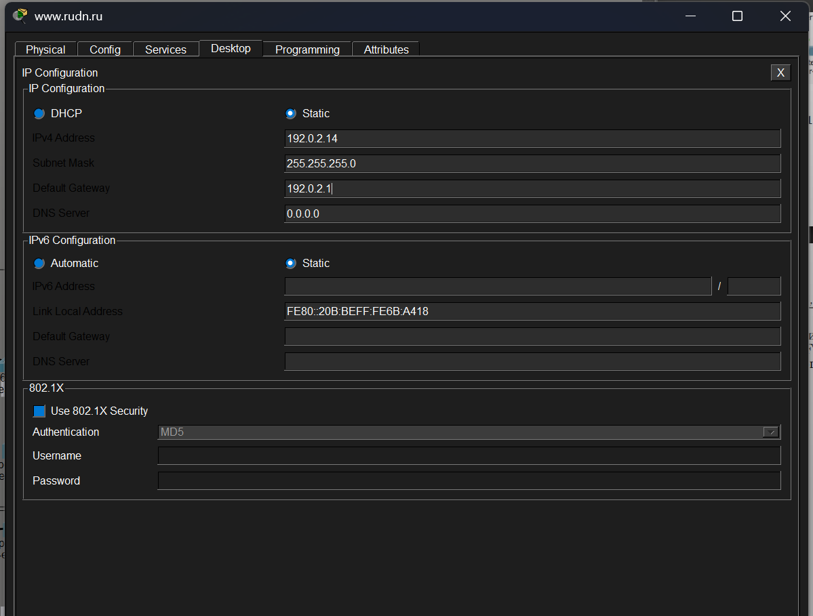
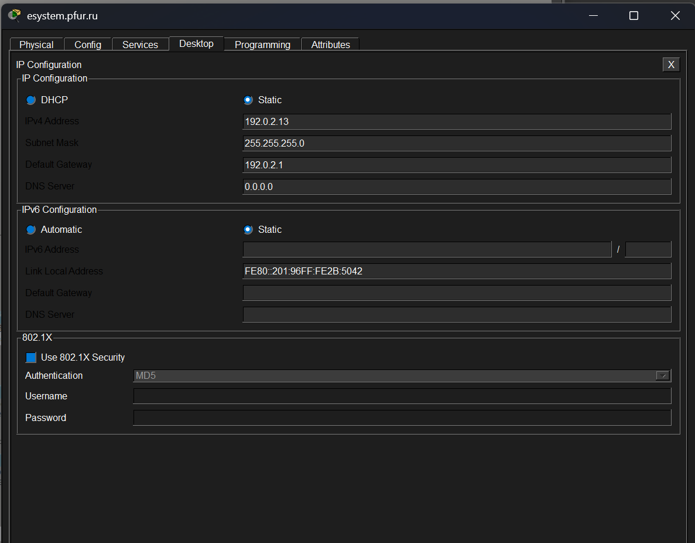
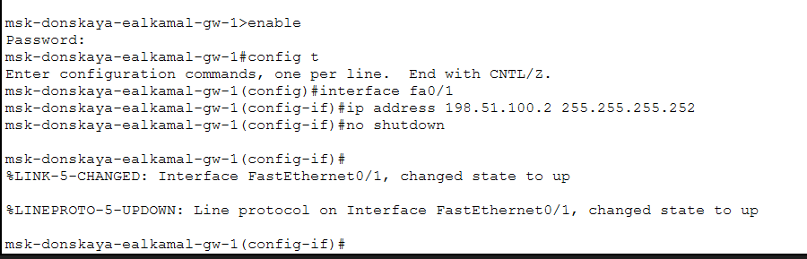

---
## Author
author:
  name: Ибрахим Мохсейн Алькамаль
  degrees: Student (3 курс)
  orcid: ""
  email: 1032225432@rudn.ru
  affiliation:
    - name: Российский университет дружбы народов
      country: Российская Федерация
      postal-code: 117198
      city: Москва
      address: ул. Миклухо-Маклая, д. 6

## Title
title: "Отчёт по лабораторной работе №11"
subtitle: "Администрирование локальных сетей"
license: "CC BY"
---

# Цель работы

Провести подготовительные мероприятия по подключению локальной сети
организации к Интернету.

# Выполнение лабораторной работы

## Построение схемы L1

На первом этапе была сформирована физическая топология сети уровня L1, включающая сегмент Интернета, провайдера и локальной сети. В сегменте Интернета размещён коммутатор, к которому подключены серверы по интерфейсам FastEthernet, а также медиаконвертер для связи с сетью провайдера ([рис. @fig-1]).

{#fig-1 width=70%}

## Детализация соединений в сегменте Интернета

Была уточнена структура соединений: серверы подключены к коммутатору через интерфейсы Fa0/2–Fa0/5, а соединение с провайдером осуществляется через медиаконвертер. Отображены направления передачи данных между устройствами ([рис. @fig-2]).

{#fig-2 width=70%}

## Настройка медиаконвертера

В конфигурации медиаконвертера выбраны соответствующие модули для подключения по Fast Ethernet и оптоволокну, что обеспечивает корректную передачу данных между сегментами сети ([рис. @fig-3]).

{#fig-3 width=70%}

## Размещение сети в физической области

Сеть была распределена по физической области, где выделены отдельные здания: Donская, Павловская, провайдер и Интернет. Между зданиями организованы соединения каналов передачи данных ([рис. @fig-4]).

{#fig-4 width=70%}

## Настройка IP-адреса сервера www.yandex.ru

Для сервера www.yandex.ru задан статический IP-адрес 192.0.2.11 с маской 255.255.255.0 и шлюзом по умолчанию 192.0.2.1 ([рис. @fig-5]).

{#fig-5 width=70%}

## Настройка IP-адреса сервера www.rudn.ru

Для сервера www.rudn.ru установлен статический IP-адрес 192.0.2.14 с маской 255.255.255.0 и шлюзом 192.0.2.1 ([рис. @fig-6]).

{#fig-6 width=70%}

## Настройка IP-адреса сервера stud.rudn.university

Сервер stud.rudn.university настроен со статическим IP-адресом 192.0.2.12, маской 255.255.255.0 и шлюзом 192.0.2.1 ([рис. @fig-7]).

{#fig-7 width=70%}

## Настройка IP-адреса сервера esystem.pfur.ru

Для сервера esystem.pfur.ru задан статический IP-адрес 192.0.2.13, маска 255.255.255.0 и шлюз 192.0.2.1 ([рис. @fig-8]).

{#fig-8 width=70%}

## Настройка DNS-сервера

На DNS-сервере добавлены записи типа A для всех серверов сети, включая внутренние и внешние ресурсы, с указанием соответствующих IP-адресов ([рис. @fig-9]).

{#fig-9 width=70%}

## Настройка интерфейсов маршрутизатора провайдера

На маршрутизаторе провайдера настроен интерфейс Fa0/0 с IP-адресом 192.0.2.1/24 для сети Интернета и интерфейс Fa0/1 с адресом 198.51.100.1/30 для соединения с локальной сетью ([рис. @fig-10]).

{#fig-10 width=70%}

## Настройка интерфейса маршрутизатора локальной сети

На маршрутизаторе локальной сети настроен интерфейс Fa0/1 с IP-адресом 198.51.100.2/30 для подключения к сети провайдера ([рис. @fig-11]).

{#fig-11 width=70%}

## Выводы

В ходе выполнения работы была построена модель сети с подключением к провайдеру и сети Интернет, включая настройку физической топологии, соединений и адресации узлов. Были назначены статические IP-адреса серверам модельной сети и настроено взаимодействие между сегментами сети через маршрутизаторы.

Дополнительно была реализована настройка DNS-сервера с добавлением записей типа A для обеспечения разрешения доменных имён в IP-адреса. Это позволило обеспечить доступ к сетевым ресурсам как по IP-адресам, так и по именам.

В результате выполненных действий обеспечена связность сети и корректное взаимодействие между всеми её элементами, что соответствует поставленной задаче по подготовке сети к работе и подключению к Интернету .

