---
## Author
author:
  name: Ибрахим Мохсейн Алькамаль
  degrees: Student (3 курс)
  orcid: ""
  email: 1032225432@rudn.ru
  affiliation:
    - name: Российский университет дружбы народов
      country: Российская Федерация
      postal-code: 117198
      city: Москва
      address: ул. Миклухо-Маклая, д. 6
## Title
title: Лабораторная работа №14
subtitle: Администрирование локальных сетей
license: CC BY
date: today
date-format: "YYYY-MM-DD" # Example: 2025-09-06
---

# Информация

## Докладчик

:::::::::::::: {.columns align=center}
::: {.column width="70%"}

  - Ибрахим Мохсейн Алькамаль
  - Российский университет дружбы народов
  - [GitHub](https://github.com/Ebrahimalkamal2027)

:::
::: {.column width="30%"}

:::
::::::::::::::

# Цель работы

- Настройка взаимодействия сетей через провайдера
- Настройка статической маршрутизации между центральной сетью, q42 и Sochi

# Выполнение лабораторной работы

## Настройка транковых соединений сети провайдера

- Настройка trunk-интерфейсов FastEthernet0/3 и FastEthernet0/4
- Создание VLAN 5 и VLAN 6
- Организация связи между филиалами и центральной сетью

---

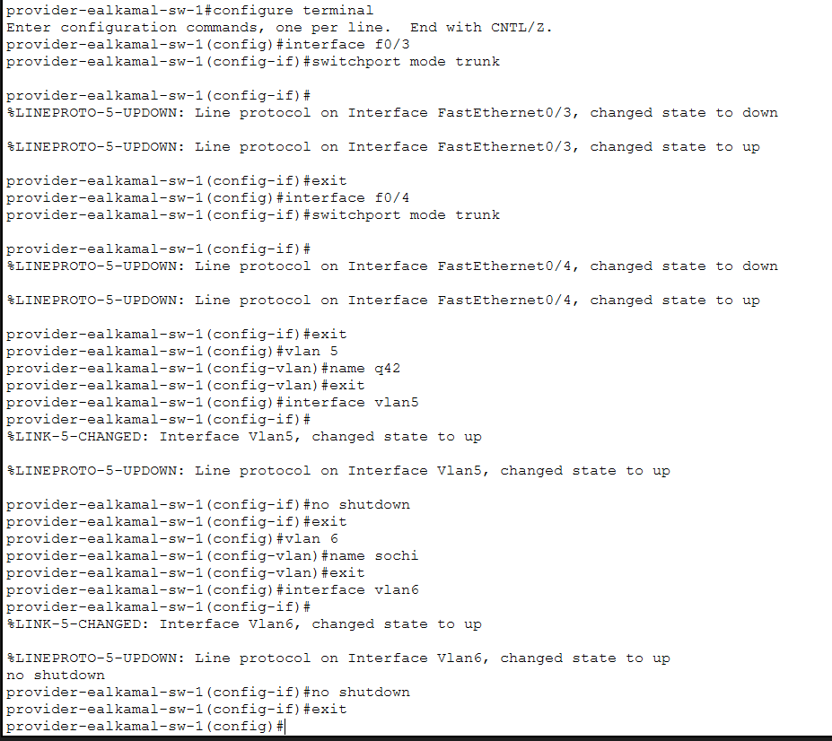{#fig-1 width=70%}

## Настройка маршрутизатора центральной сети

- Создание подинтерфейсов FastEthernet0/1.5 и FastEthernet0/1.6
- Настройка encapsulation IEEE 802.1Q
- Назначение IP-адресов для сетей q42 и sochi

---

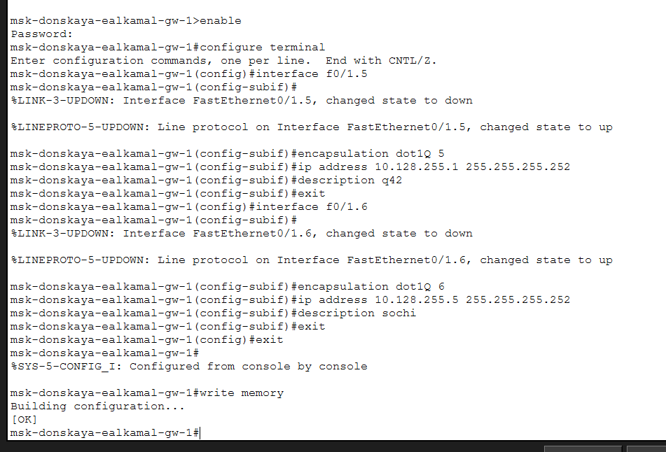{#fig-2 width=70%}

## Настройка маршрутизатора сети q42

- Активация интерфейса FastEthernet0/1
- Настройка подинтерфейса FastEthernet0/1.5
- Подключение VLAN 5 к центральной сети

---

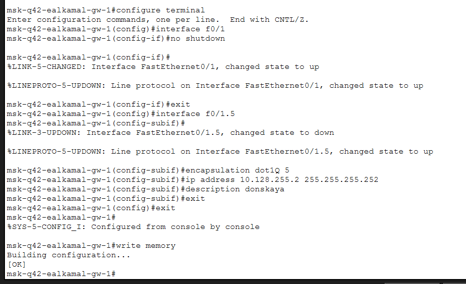{#fig-3 width=70%}

## Настройка коммутатора сети Sochi

- Настройка trunk-интерфейсов FastEthernet0/23 и FastEthernet0/24
- Создание VLAN 6
- Организация связи с магистральной сетью

---

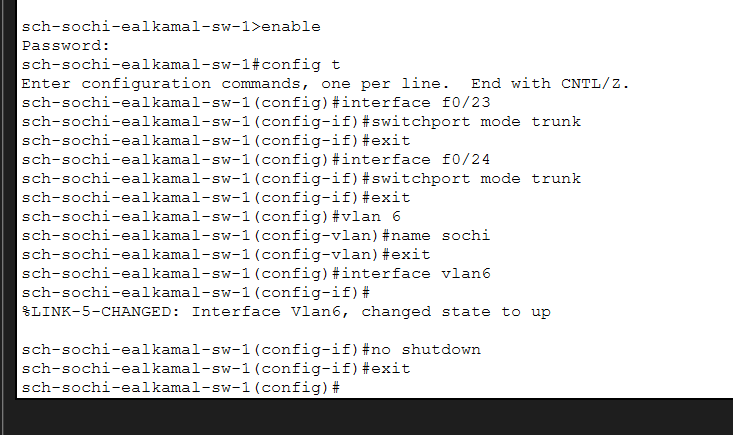{#fig-4 width=70%}

## Настройка маршрутизатора сети Sochi

- Активация интерфейса FastEthernet0/0
- Создание подинтерфейса FastEthernet0/0.6
- Назначение IP-адреса подключения к центральной сети

---

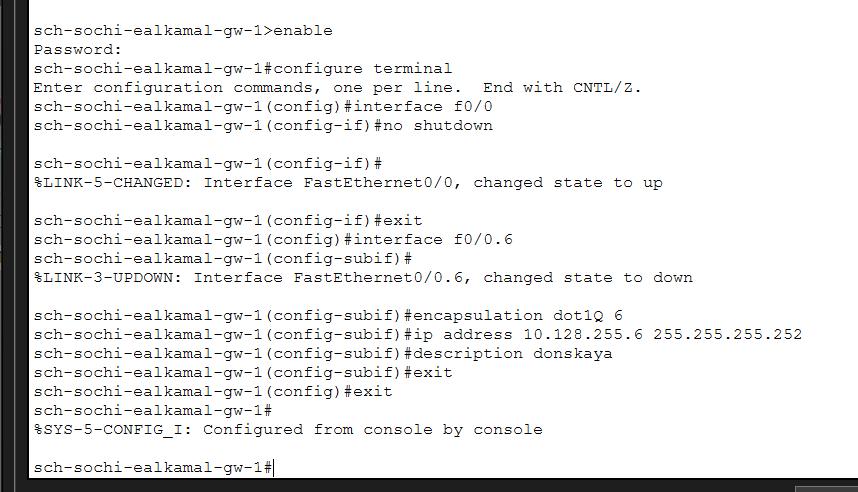{#fig-5 width=70%}

## Настройка VLAN сети q42

- Создание подинтерфейсов FastEthernet0/0.201 и FastEthernet1/0.202
- Настройка VLAN q42-main и q42-management
- Назначение IP-адресов и описаний интерфейсов

---

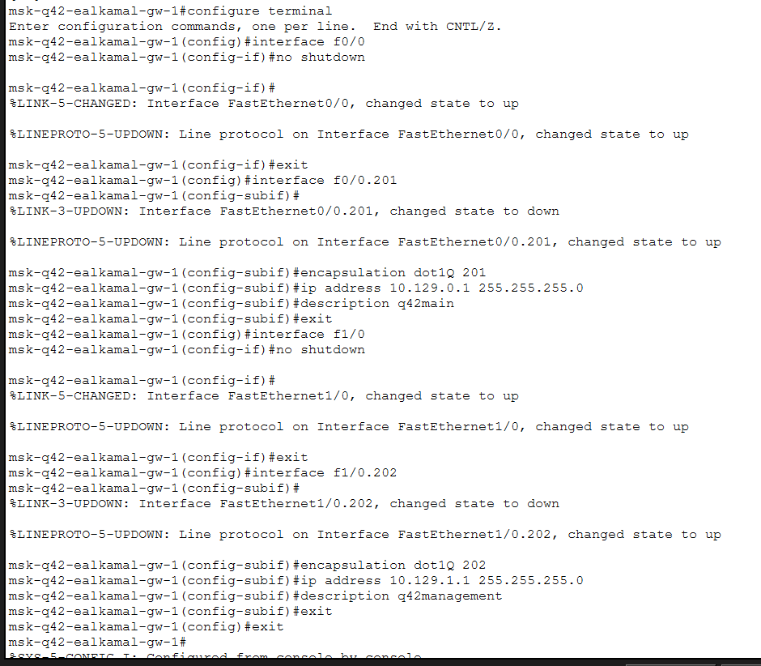{#fig-6 width=70%}

## Настройка VLAN сети hostel

- Настройка VLAN 202 и VLAN 301
- Назначение IP-адресов виртуальным интерфейсам
- Включение маршрутизации между VLAN

---

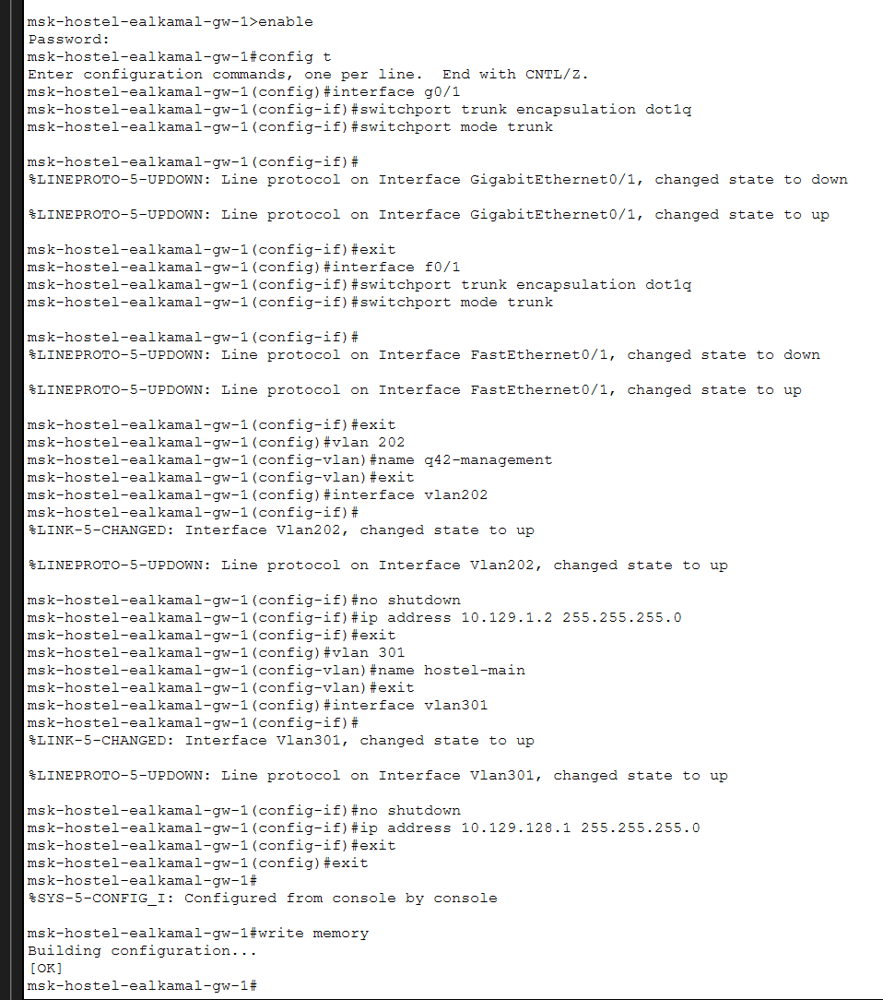{#fig-7 width=70%}

## Настройка коммутатора сети hostel

- Настройка trunk-порта GigabitEthernet0/1
- Перевод FastEthernet0/1 в access VLAN 301

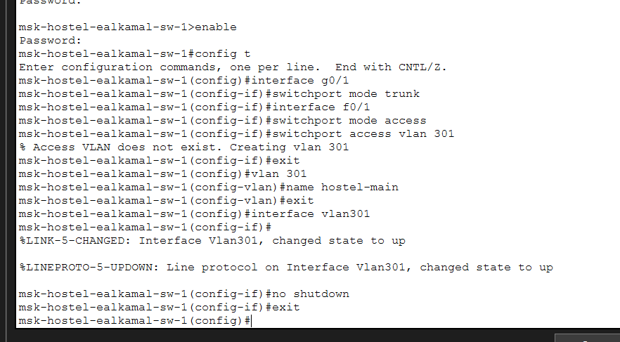{#fig-8 width=70%}

## Настройка VLAN сети Sochi

- Создание подинтерфейсов FastEthernet0/0.401 и FastEthernet0/0.402
- Настройка VLAN sochi-main и sochi-management
- Назначение IP-адресов интерфейсам

---

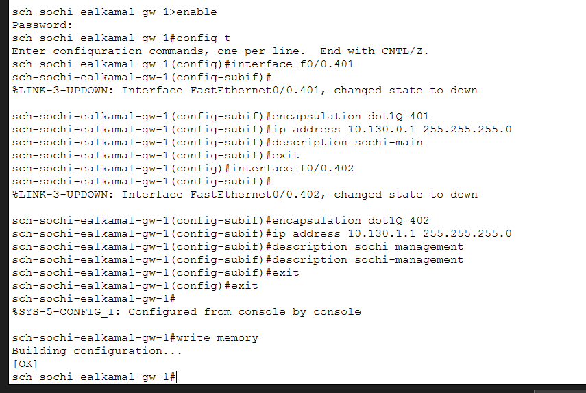{#fig-9 width=70%}

## Настройка access-порта сети Sochi

- Перевод интерфейса FastEthernet0/1 в режим access VLAN 401
- Создание интерфейса VLAN401

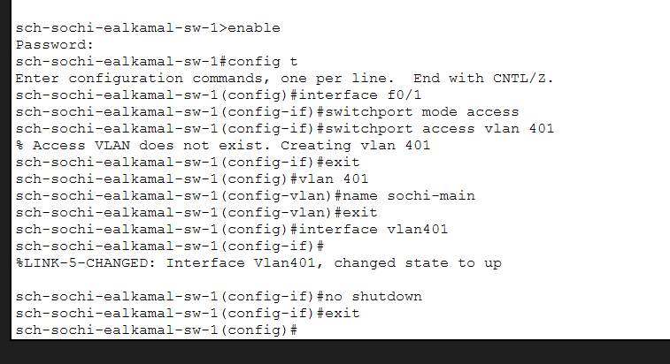{#fig-10 width=70%}

## Настройка статической маршрутизации центральной сети

- Добавление маршрутов к сетям 10.129.0.0/16 и 10.130.0.0/16
- Использование маршрутизаторов q42 и Sochi как next-hop

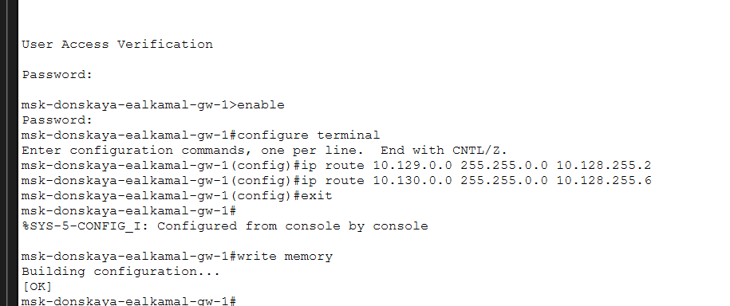{#fig-11 width=70%}

## Настройка маршрута по умолчанию сети q42

- Настройка default route через 10.128.255.1

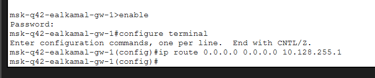{#fig-12 width=70%}

## Настройка маршрута по умолчанию сети Sochi

- Настройка default route через 10.128.255.5

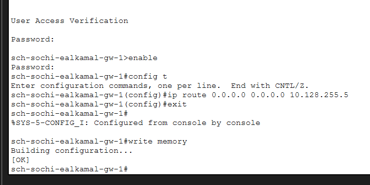{#fig-13 width=70%}

## Настройка маршрута к сети hostel

- Добавление маршрута к сети 10.129.128.0/17
- Использование адреса 10.129.1.2 как next-hop

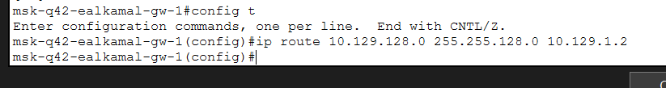{#fig-14 width=70%}

## Настройка маршрутизации сети hostel

- Включение IP routing
- Настройка default route через 10.129.1.1

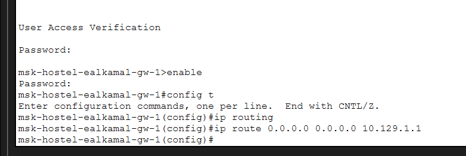{#fig-15 width=70%}

## Настройка NAT

- Определение FastEthernet0/1.5 и FastEthernet0/1.6 как NAT inside
- Создание ACL nat-inet
- Разрешение NAT для сетей q42, hostel и sochi

---

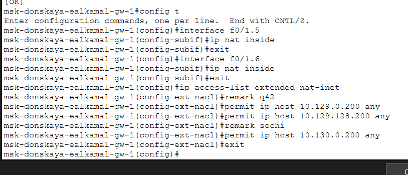{#fig-16 width=70%}

## Итоговая топология сети

- Формирование итоговой топологии сети
- Подключение q42, hostel, Sochi и сети провайдера
- Интеграция модельной сети Интернет

---

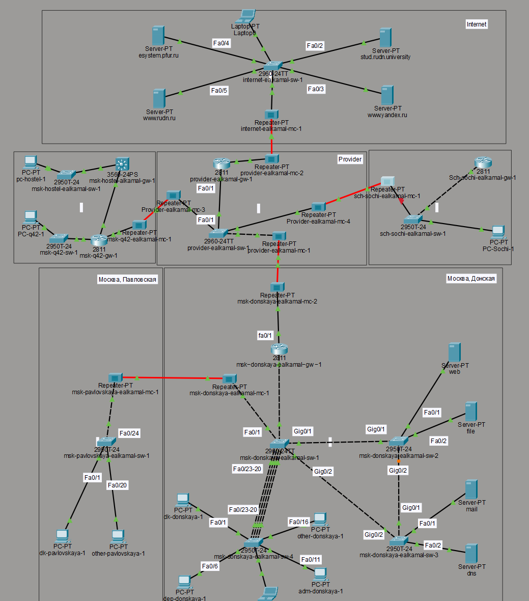{#fig-17 width=70%}

# Выводы

- Настроены VLAN и trunk-соединения
- Реализована статическая маршрутизация между площадками
- Настроен NAT для взаимодействия с внешней сетью
- Построена итоговая топология сети с филиалами и Интернетом
